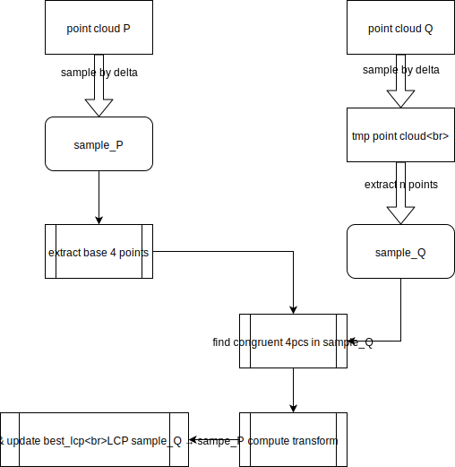

# Super4pcs 源码分析以及3d全局定位应用
## Super4pcs
### PipeLine


### 基础4点的选择


### 实现代码分析
Demo Align $Q \to P $
```c++
using MatcherType = Match4pcsBase<FunctorSuper4PCS, TrVisitorType,
 AdaptivePointFilter, AdaptivePointFilter::Options>;
using OptionType = MatcherType::OptionsType;
using SamplerType = UniformDistSampler;
OptionType potions;
options.overlap_estimation // 重叠的比例
options.sample_size = n_points; // ps_P采样点数量
options.max_normal_difference = norm_diff; // correspondense 点允许的最大法向差异
options.max_color_distance = max_color; // 颜色差异 (不考虑使用)
options.max_time_seconds = max_time_seconds; // 时间限制 (不考虑使用)
options.delta = delta; // 采样间隔, 允许的correspondense pair的长度差异, 并在LCP验证时作为配上和不配上的阈值

SamplerType sampler; // 对点云ps_P, 进行均匀采样
// 计算ps_Q to ps_P 的transformation matrix
Point3D::Scalar score = computeAlignment<MatcherType>(options, logger, ps_P, ps_Q, mat, sampler, visitor);
```
主要的类结构
* `AdaptivePointFilter` 利用法向, 颜色等信息来过滤掉不符合条件的2点对
* `PairCreationFunctor` 给定距离条件, 抽取2点对
* `FunctorSuper4pcs` 共面4点集的抽取，并寻找correspondense.
* `Match4pcsBase` 多次尝试[寻找4点集合correspondense, 并用LCP判断配准情况], 选取最优配准


代码分析:
```c++
computeAlignment<MatcherType>(options, logger, P, Q, mat, sampler, visitor)
{
  // function in file congruentSetExplorationBase.hpp line 54
  // 调用macher的函数计算Q to P 的transformation 
  Point3D::Scalar score = matcher.ComputeTransformation(P, Q, mat, sampler, visitor)
  {
    // 初始化
    // 对P, Q进行均匀采样采样点为预设值options.sample_size, 并将中心移动到(0,0,0)
    // 对P的采样点, 构建kdtree
    // 初始化functorSuper4pcs(P, Q)
    MatchBaseType::init(P, Q, sampler)
    {
      // 对P, Q进行均匀采样, 并将中心移到(0,0,0)
      sampler(P, options_, sampled_P_3D_);
      sampler(Q, options_, uniform_Q); // 对Q采样完成之后, 还会对点进行间隔采样, 使得点的数量等于预设值.
      centerPoints(sampled_P_3D_, centroid_P_);
      centerPoints(sampled_Q_3D_, centroid_Q_);

      // functin in file match4pcsBase.hpp line 199
      // 这里P,Q是无效参数, 之后算法均基于采样之后的sample_P_3D和sample_Q_3D
      Initialize(P,Q)
      {
        // 这里fun_ 即FunctorSuper4pcs,
        // 其成员mySampled_Q_3D_是MatchBaseType类sample_Q_3D的引用
        fun_.Initialize(P,Q);
      }
    }

    // function in file congruentSetExplorationBase.hpp line 119
    // 多次尝试选取最优
    Perform_N_steps(number_of_trials_, transformation, v)
    {
      // function in file congruentSetExplorationBase.hpp line 185
      // 尝试一次
      TryOneBase(v)
      {
        // function in file match4pcsBase.hpp line 207
        // P上生成一组4点set, 并在Q上找到correspondense
        generateCongruents(base, congruent_quads);
        {
          // 先随机选三个点, 再找第四个距离最远的共面点
          SelectQuadrilateral(invariant1, invariant2, base[0], base[1],
                                base[2], base[3]);
          // 通过 初始化functorSuper4pcs 找到所有距离相近的pair
          // 然后通过invariant来找到correspondense 4点set
          fun_.ExtractPairs(...);
          fun_.ExtractPairs(...);
          fun_.FindCongruentQuadrilaterals(...);
        }

        // function in file congruentSetExplorationBase.hpp line 217
        // 使用 LCP 判断有多少%的点云匹配上(在阈值范围内能找到对应点) 
        TryCongruentSet(base,congruent_quads,v,nb);
      }
    }
  }
}  
```


## 问题&改进

### 提高鲁棒性
问题:
①. 激光帧Q有可能数据非常少, 导致在P中找的4点集无法在Q中找到对应
②. 如何保证LCP verify的匹配率计算的合理性

在激光全局重定位中, 我们
* 选取当前帧作为点云P, 选取局部地图作为点云Q(这里假设我们知道机器人大概所在区域)
当前帧中抽点与局部地图配, 大概率能找到对应, 但也意味着会找到很多对应, 加重了筛选的负担.

* 我们对算法的LCP Verify做一定调整, 改为sample_P $\to$ Q找对应, 计算匹配率. [这里用得分表来计算匹配率]

### 提速
备选集合选取优化
* 先以较小的阈值查找四点集合, 若找不到, 再以较大阈值去搜索.

#### z值方向上的相互约束
在extract pair和correspondense时加入z值相差相近的约束.

一个程序的bug:
```c++
  // file pairCreationFunctor.h line 150
  inline void process(int i, int j){
    if (i>j){
      const Point3D& p = Q_[i]; // 修改前这里是 Q_[j]
      const Point3D& q = Q_[j]; // 修改前这里是 Q_[i]

      // 而这里 first=true指的是 i->b0, j->b1, second=true指的是 i->b1, j->b0
      // 从而在filter这个函数中first 和 second的意义就有点怪了
      std::pair<bool,bool> res = fun(p,q, pair_normals_angle, base_3D_[base_point1_],base_3D_[base_point2_], options_);
        if (res.first)
            pairs->emplace_back(i, j);
        if (res.second)
            pairs->emplace_back(j, i);
```

#### 加入更多法向约束
由于激光的特性, 在小场景中法向比较准确, 场景稍大, 法向的估计就会出现很大偏差. 所以当下不使用这种策略.
当然, 也可以选择性地加入法向的约束, 若点能够计算比较准确的法向(点周围比较密集), 则加入法向的约束, 否则不加入.

### 基于Transform的过滤
根据congruent 4pcs可以计算出Transform, 由先验的知识, 我们假定transform只有: x, y, yaw三个主要维度.
根据此进一步筛选掉那些在其他维度上transform很大的组合, 并将这三个量投影到一个3d空间中(GICP), 若其附近有已知的try, 则略过该组合.

#### 使用特征点作为采样点
使用更好的采样选点策略, 或者使用特征点(Lego的点云分类)，使得点的数量更少
* 去除地面点(z值的约束保证地面的匹配), 地面点也会导致太多的共面点
* 优先选取特征点
  当Q中的点包含较多散布的特征点时则在Q中选择特征点
* 不要都选在同一水平角上的点

#### LCP verify speedup
随机采一些点, 若百分比在一定范围内，在验证另外的点