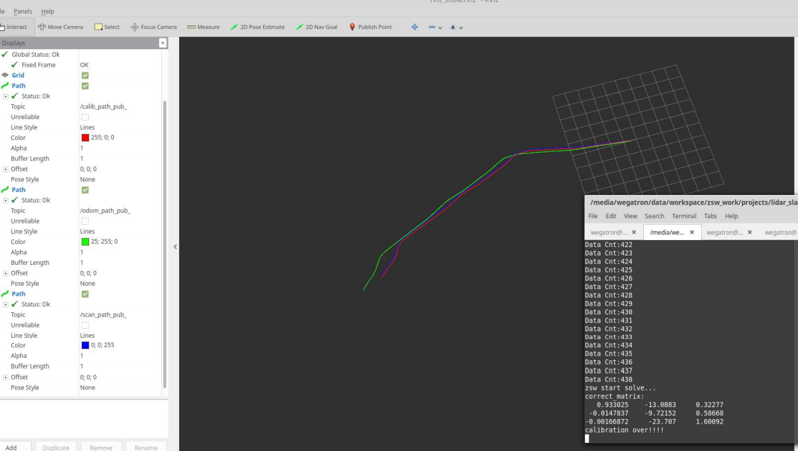
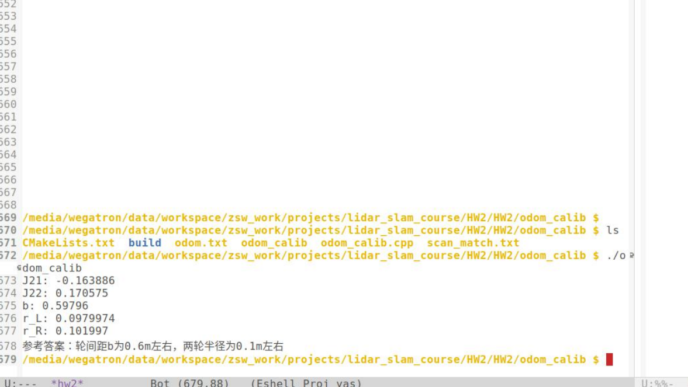

## 1. 线性直接法标定模块代码

## 2. 基于模型方法里程计标定

## 3. Ax=b的求解方法
对于多元一次线性方程组$Ax=b$, 有两种策略, 一种是对曾广矩阵进行高斯消元, 若A为n阶方阵则计算复杂度$O(n^3)$. 用这种方法, 若b改变, 则需要重新计算.另一种策略是使用不同种方式对$A$进行分解, 然后对A求逆, 好处是: 计算完成后不依赖与b, 不需要重新计算.

* LLT(Cholesky)分解
设A是一个n阶厄米特正定矩阵(Hermitian positive-definite matrix). Cholesky分解的目标是把A变成: $A = LL^T$, L是下三角矩阵.
Eigen有基本的LLT分解, 以及其优化版LDLT分解(解决了LLT需要开方精度差的问题). LLT分解要求矩阵对称正定, 而LDLT可以对正定，半正定, 负半正定矩阵进行分解, 且精度比LLT高. 相比于其他分解, LLT, LDLT分解速度快很多.

* LU分解
先通过高斯消元, 将矩阵A变为上三角矩阵和下三角矩阵乘积LU, 从而$Ax = LUx = b$ --> $Ux = L^{-1}b$, 然后求解. 若在高斯消元过程中必须进行行交换, 则可以先将A乘上一个置换矩阵P, 即PA = LU, 又有A = PLU.
Eigen中提供了PartialPivLU和FullPivLU, 前者要求A是可逆, 但速度快. 后者对A没有要求，更稳定, 但速度慢.
LU with partial pivoting 计算量$\frac{2}{3} n^3$.

* QR分解
任意实数方阵$A$, 都能被分解为$A=QR$. 这里的Q为正交单位阵, 即$Q^TQ=I$. $R$是一个上三角矩阵. 这种分解被称为QR分解. QR分解也有若干种算法, 常见的包括Gram–Schmidt、Householder和Givens算法.
Eigen中提供了Householder算法的不同种实现: HouseholderQR, 基本的实现, 速度快, 不进行置换. ColPivHouseholderQR, 通过列置换来达到秩显, 增加了的HouseholderQR分解稳定性, 速度比基本HouseholderQR慢. FullPivHouseholderQR， 通过一个强大的置换来进行秩显, 比上者更加稳定, 但速度更慢.
Householder-based QR 计算量$\frac{4}{3} n^3$.

* SVD分解
[SVD分解方法精度高, 但相比于QR分解法要花上近十倍的计算时间](http://zhaoxuhui.top/blog/2019/08/22/eigen-note-2.html#3svd%E5%88%86%E8%A7%A3)

总结: Cholesky, LU, QR, SVD. 速度越来越慢, 数值稳定性越来越高, 不同分解对矩阵的各有不同的要求.
[Performance Reference](https://scicomp.stackexchange.com/questions/1026/when-do-orthogonal-transformations-outperform-gaussian-elimination)

## 4. 里程计与激光雷达外参标定方法设计
参考基于模型方法里程计标定, 对激光雷达的内外参, 进行迭代优化: 首先我们给定一个粗糙的内参, 对于收到的传感器数据, 按照时间进行对齐. 根据给定的内参, 通过积分和插值, 计算出激光帧两两之间, 里程的Transform $T_{oi}$, 通过ICP计算激光帧之间的Transform $T_{li}$, 我们有外参$T_{li} = T_{o2l} \cdot T_{oi}$, 然后通过最小二乘来计算$T_{o2l}$, 计算出$T_{o2l}$后再以此为外参, 去优化内参, 循环迭代多次, 直到收敛.

1) 这里假设给定的内参初始值与真实值非常接近, 传感器之间时间同步正常(在同一个时间坐标系中). 观测值为激光雷达的匹配Transform即$T_{li}$, 预测值为里程计积分所得Transform乘以$T_{o2l} \cdot T_{oi}$
2) 对于2D应用, $T_{o2l}$为一个$3 \times 3$矩阵, 且最后一行恒为$[0,0,1]$
$$
T_{o2l} = 
\begin{bmatrix}
x_1 & x_2 & x_3 \\
x_4 & x_5 & x_6 \\
0 & 0 & 1
\end{bmatrix}
$$

最小二乘残差定义为:
$$
E = \sum_{i=0}^n \parallel T_{li} - T_{o2l} T_{oi} \parallel^2
$$