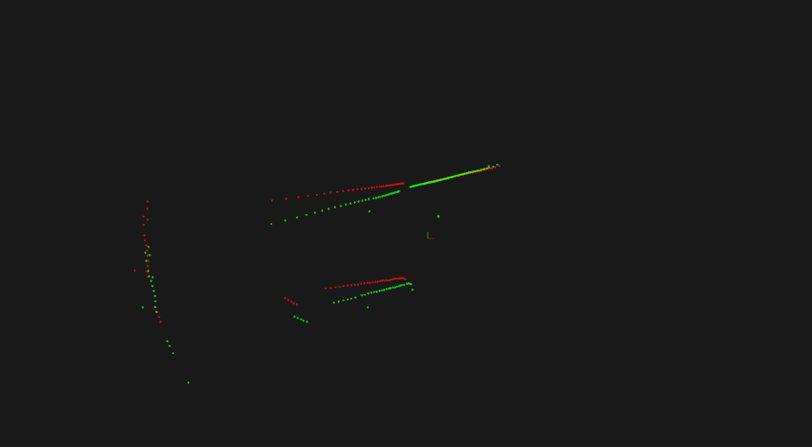
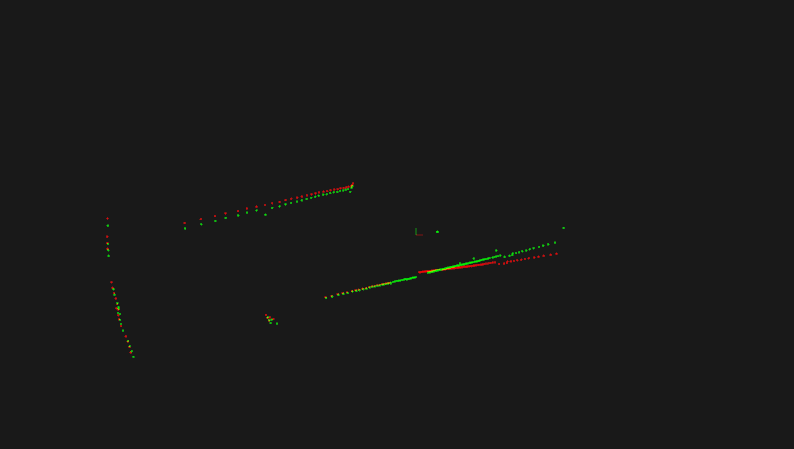

## 1. 去除激光雷达运动畸变

## 2. ICP求解方法
给定已经对应好的两个3D点集$ \{p_i\}, \{p'_i\}$, 有
$$p'_i = R p_i + T + N_i$$

这里, $R$是旋转矩阵, $T$是平移向量, $N_i$是噪声. 我们的目标是最小化如下残差
$$
\Sigma^{2}=\sum_{i=1}^{N}\left\|p_{i}^{\prime}-\left(R p_{i}+T\right)\right\|^{2}
$$

使用如下方式求解:
1. 去中心化, 求解$T$. 分别计算两个点集的中心点, 然后将中心点移动到(0,0,0), 得到对应的点集${q_i}$和${q'_i}$.

$$
\begin{aligned}
\bar{p}' = \frac{1}{N} \sum_{i=1}^n p_i' \\
\bar{p} = \frac{1}{N} \sum_{i=1}^n p_i \\
q_i = p_i - \bar{p} \\
q_i' = q_i - \bar{p}'
\end{aligned}
$$

通过去中心话, 我们可以把旋转和平移进行拆分, 平移即是两个点集中心之间的差异$T = \bar{p}' - \bar{p}$, 而R则可以通过优化如下残差
$$
\Sigma^{2}=\sum_{i=1}^{N}\left\|q_{i}^{\prime}-R q_{i}\right\|^{2}
$$

2. SVD分解, 求解$R$.
对残差进行展开, 有:

$$
\begin{aligned} \Sigma^{2} &=\sum_{i=1}^{N}\left(q_{i}^{\prime}-R q_{i}\right)^{t}\left(q_{i}^{\prime}-R q_{i}\right) \\ &=\sum_{i=1}^{N}\left(q_{i}^{\prime t} q_{i}^{\prime}+q_{i}^{t} R^{\prime} R q_{i}-q_{i}^{\prime t} R q_{i}-q_{i}^{t} R^{t} q_{i}^{\prime}\right) \\ &=\sum_{i=1}^{N}\left(q_{i}^{\prime t} q_{i}^{\prime}+q_{i}^{t} q_{i}-2 q_{i}^{\prime t} R q_{i}\right) \end{aligned}
$$

从而最小化$\Sigma^{2}$等价于最大化
$$
\begin{aligned} F &=\sum_{i=1}^{N} q_{i}^{\prime t} R q_{i} \\ &=\operatorname{Trace}\left(\sum_{i=1}^{N} R q_{i} q_{i}^{\prime t}\right)=\text { Trace }(R H) \end{aligned}
$$

对$H=\sum_{i=1}^{N} q_i q_i^{\prime t}$进行SVD分解, $H=U \Lambda V^{t}$, $R$是一个单位正交阵, 由Schwarz不等式可知, 当$R = V U^t$时, $\operatorname{Trace}(RH)$取最大值. 因此, $R=V U^t$.

## 3. Precise indo r localization for mobile aser scaner
1. 激光雷达通过飞行时间(TOF)原理进行测距$r=\frac{\Delta t \cdot c}{n \cdot 2}$, 这里n是空气的折射率. 已知激光的频率, 通过对比发射和接受的波形图, 计算相位差$\Delta \varphi$, 从而计算飞行时间$\Delta t = \frac{\Delta \varphi \cdot f_m}{2 \pi}$.

2. 右图描述了光束模型, 激光的测量可能有四种不同的情况. ①激光达到物体上正常返回, 测量距离是真实距离的高斯分布(蓝色线); ②激光被动态物体所遮挡, 测量距离是一个指数分布(绿色线); ③激光返回最大值(粉色线); ④激光返回均匀噪声(红色线).

## 4. IMU去除Lidar运动畸变
1. IMU只能测量线加速度, 因此, 位移由线加速度两次积分得到, 会有较大误差, 而且IMU测量会存在bias和噪声, 使得时间长了之后会产生很大累计误差.

2. 根据上述提到的问题, 需要将IMU的bias和噪声考虑进来, 激光雷达和IMU数据之间相互优化. 首先需要是用融合的方法对激光数据进行校正: 通过IMU计算运动畸变, 从而优化激光帧配准, 然后通过激光帧配准的信息计算两帧之间的Transform, 从而再优化IMU的测量bias和噪声, 迭代优化, 直到收敛.