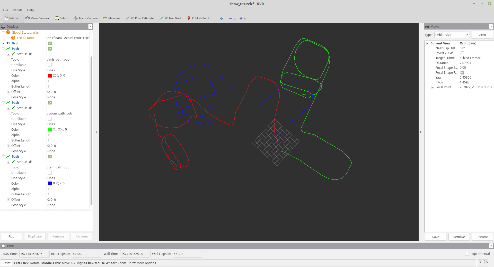

## 1+2题合并
参考imls的代码, 将csm的路径加入其中, 效果如下图(蓝色为csm, 红色为imls, 绿色为odo).

## 3.ICP总结
各类(ICP, PL-ICP, NICP, IMLS-ICP)的共同点是, 流程都一样, ①先寻找correspondense, ②然后构建error residual并最小化之， ①②迭代进行多次. 

最基本的ICP, 以最近点作为correspondense, 并以对应点之间的距离作为 error residual. 

PL-ICP对其做了优化, 以点到线(2D)或点到面(3D)的距离作为error residual.

NICP对其更进一步改进, 将点与点之间的ICP变为局部小平面与小平面之间的匹配. 根据法向, 曲率, 对应点间距离, 对correspondense进行了筛选, 去除误匹配, 然后又将法向加入到了误差之中(误差又原来的3维向量扩展到了6维向量), 该算法更鲁棒和精细.

IMLS-ICP是专为3d激光雷达SLAM设计的算法, 将局部隐式曲面间的误差作为残差, 对点云做了更多预处理(运动畸变, 去除动态物体), 并根据点的平面度, 进行了点的筛选.

总的来说, ICP, PL-ICP, NICP, IMLS-ICP, 算法越来越复杂, 效果越来越好, 速度越来越慢.

## 4. 改进ICP算法
通过上诉总结, 个人人为, ICP算法改进的方向有: ①对应点的选取; ②误差的表示方法. 参考当前效果好的SLAM方法LOAM, LOAM有速度快但要求帧间运动小(运动大了之后, 对应点容易找错), 而NICP, IMLS则速度慢, 但鲁棒性好. 对于3D激光SLAM, 或许可以参考这些方法, 对LOAM的对应点选取做一些优化. 比如, 加入法向的筛选, 优先选取较好的对应点, 将三维误差扩展到6维等.