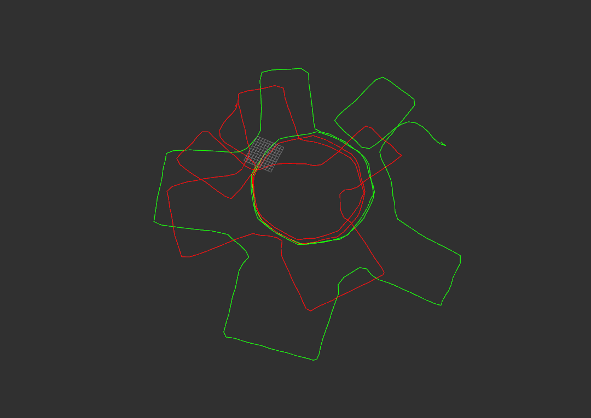

## 1. gaussian_newton_scanmatcher

见代码
## 2. 提升第一题激光匹配轨迹精度的方法
使用滑动窗口, 构建局部地图, 以scan to local map的方式匹配. 该方法相比与帧间匹配有更好的全局一致性.

## 3. NDT
①ndt优化函数:

$$
\mathrm{minimize} \quad -\operatorname{score}(\mathbf{p})=-\sum_{i} \exp \left(\frac{-\left(\mathbf{x}_{i}^{\prime}-\mathbf{q}_{i}\right)^{t} \Sigma_{i}^{-1}\left(\mathbf{x}_{i}^{\prime}-\mathbf{q}_{i}\right)}{2}\right)
$$

这里$\mathbf{p} = (t_x, t_y, \phi)^t$

②ndt优化过程:
使用牛顿法进行迭代优化$\mathbf{H} \Delta \mathbf{p}=-\mathbf{g}$, 根据①中的优化函数, 求出Jacobian和Hessian, 令$\mathbf{q} = x_i^{\prime} - \mathbf{q}_i$,
则$s=-\exp \frac{-\mathbf{q}^{\mathrm{t}} \mathbf{\Sigma}^{-1} \mathbf{q}}{2}$, $\mathbf{g}, \mathbf{H}$通过如下方法计算:

$$
\begin{aligned}
\tilde{g}_{i} &= -\frac{\partial s}{\partial p_{i}}=-\frac{\partial s}{\partial q} \frac{\partial q}{\partial p_{i}} = \mathrm{q}^{\mathrm{t}} \boldsymbol{\Sigma}^{-1} \frac{\partial q}{\partial p_{i}} \exp \frac{-\mathbf{q}^{\mathrm{t}} \boldsymbol{\Sigma}^{-1} \mathbf{q}}{2}\\
\tilde{H}_{i j} &= -\frac{\partial s}{\partial p_{i} \partial p_{j}}    = -\exp \frac{-\mathbf{q}^{t} \mathbf{\Sigma}^{-1} \mathbf{q}}{2} + \left(\left(-\mathbf{q}^{\mathrm{t}} \mathbf{\Sigma}^{-1} \frac{\partial \mathbf{q}}{\partial p_{i}}\right)\left(-\mathbf{q}^{\mathrm{t}} \mathbf{\Sigma}^{-1} \frac{\partial \mathbf{q}}{\partial p_{j}}\right)+\right. \left.\left(-\mathbf{q}^{\mathrm{t}} \mathbf{\Sigma}^{-1} \frac{\partial^{2} \mathbf{q}}{\partial p_{i} \partial p_{j}}\right)+\left(-\frac{\partial \mathbf{q}^{\mathrm{t}}}{\partial p_{j}} \mathbf{\Sigma}^{-1} \frac{\partial \mathbf{q}}{\partial p_{i}}\right)\right)
\end{aligned}
$$

这里:

$$
\begin{aligned}
\frac{\partial \mathbf{q}}{\partial{p}} &= \left(\begin{array}{ccc}{1} & {0} & {-x \sin \phi-y \cos \phi} \\ {0} & {1} & {x \cos \phi-y \sin \phi}\end{array}\right)\\
\frac{\partial^{2} \mathbf{q}}{\partial p_{i} \partial p_{j}}&=\left\{\begin{array}{cc}{\left(\begin{array}{cc}{-x \cos \phi+y \sin \phi} \\ {-x \sin \phi-y \cos \phi}\end{array}\right)} & {i=j=3} \\ {\left(\begin{array}{c}{0} \\ {0}\end{array}\right)} & {\text { otherwise }}\end{array}\right.
\end{aligned}
$$

## 4. 分枝定界
①根据当前分支的上界选取最大的那个分支, 即左图中右上角分支(99); 
②99不是叶子节点, 则继续分支, 同理选取最大分支, 右图中对应87, 更新最大值为87;
③87是叶子节点, 则返回到上一级, 85这个分支不需要被搜索, 选取最大分支98;
④同理, 98中可以选取到95, 更新最大值为95, 返回上一级;
⑤同理, 搜索96的这个分支.
⑥得到最终结果95.
