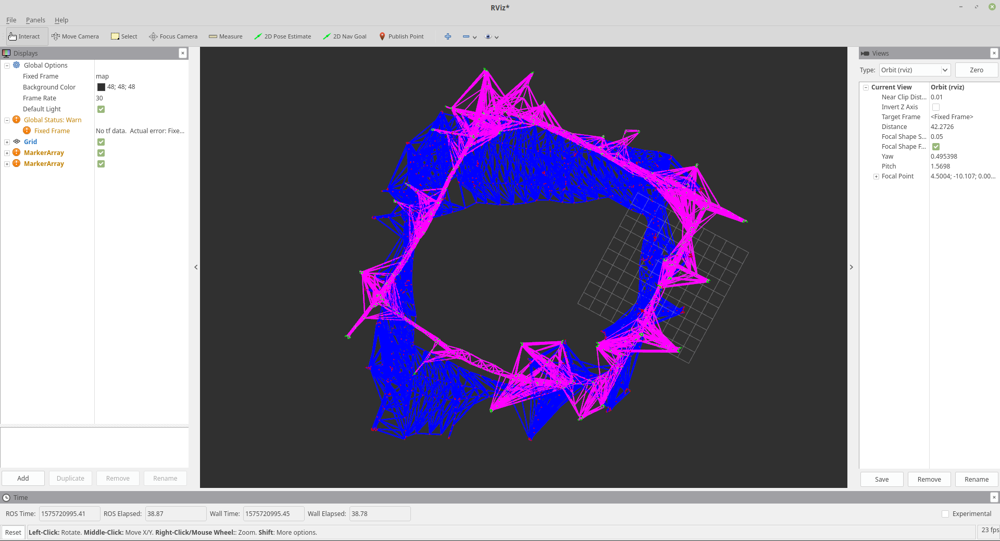
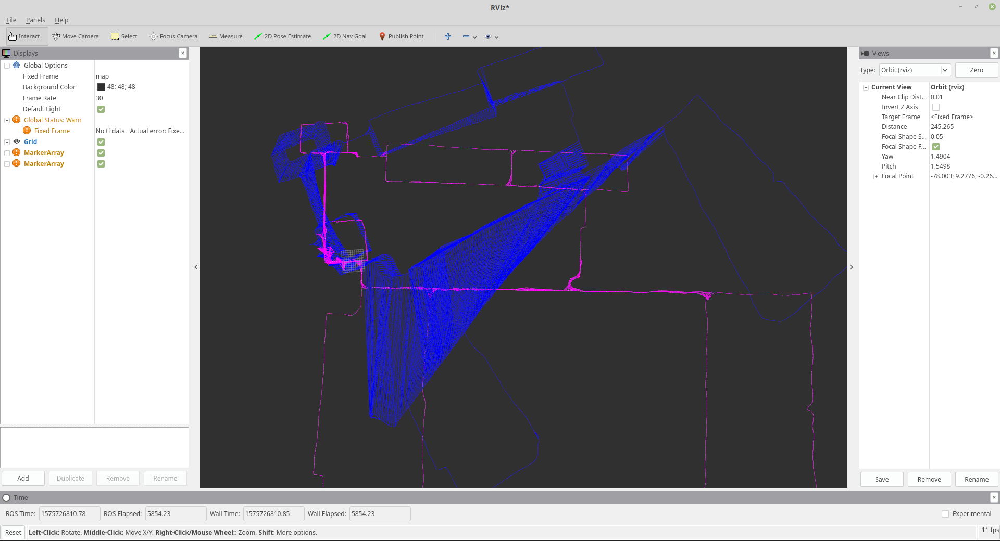

## 1. Gaussian-Newton Pose-Graph优化
程序运行结果截图:




Performance
```
CPU: Intel© Core™ i5-4210H CPU @ 2.90GHz × 2
Memory: 8G
```
| 数据 | 分解方法 | Final Error | TimeCost(s) |
| ----- | ------- | ---------- | -------- |
| intel(v=729 e=3070) | LDLT | 65.40 | 78.868540 |
| intel(v=729 e=3070) | FullPivLU | 65.402 | 1174.170862 |
| intel(v=729 e=3070) | HouseholderQR | 65.402 | 366.307586 |
| killian(v=1941 e=3995) | LDLT | 10344.7 | 1919.979211 |
| killian(v=1941 e=3995) | HouseholderQR | \ | too long |
| killian(v=1941 e=3995) | g2o | 10344.7  | 490.776 |

## 2. 耗时分析和提速
在方程$Hx=b$求解这块耗时最大. 可以根据H矩阵的稀疏性, 考虑矩阵的稀疏性, 使用合适的分解计算方法. 对图进行分块， 并行优化, 然后合并. 以及使用SIMD等技术进行优化加速.

## 3. 非线性优化方法
非线性优化问题定义:

$$
\mathrm{Find} \quad \mathbf{x}^{\star} = \mathrm{argmin}_{\mathbf{x}} \{F(\mathbf{x})\}  
$$

现实情况下, 非线性函数很难寻找全局最优解, 一般求解局部最优解.

### 线搜索方法:

$$
\begin{aligned}
F(\mathbf{x}+\alpha \mathbf{h}) &= F(\mathbf{x}) + \alpha \mathbf{h}^TF'(\mathbf{x}) + O(\alpha^2)\\
&\simeq F(\mathbf{x}) + \alpha\mathbf{h}^TF'(\mathbf{x}) \quad \mathrm{for \; \alpha \; sufficiently \; small}
\end{aligned}
$$

这里, $\mathbf{h}$是搜索方向, $\alpha$ 是搜索步长. 线搜索方法一次迭代分为两个步骤: ①选择一个搜索方向; ②选择搜索步长.

* 最速下降(梯度下降)法
梯度下降方法将非线性函数近似为其一阶泰勒展开, 取负梯度方向为搜索方向$\mathbf{h} = -F'(\mathbf{x})$, 该方法越接近目标值, 步长越小, 前进越慢, 一阶收敛, 因此在最后阶段收敛非常慢.

* 牛顿法
牛顿法将非线性函数近似为其二阶泰勒展开, 通过计算$F'(\mathbf{x})=0$得到搜索方向和步长.
$$
\begin{aligned}
F'(\mathbf{x+h}) &= F'(\mathbf{x}) +F''(\mathbf{x}) \mathbf{h} + O(\parallel\mathbf{h}\parallel^2)\\
&\simeq F'(\mathbf{x}) + F''(\mathbf{x}) \mathbf{h} \quad \mathrm{for \parallel \mathbf{h} \parallel sufficiently \; small}\\
\Rightarrow \mathbf{H}\mathbf{h} &= -F'(\mathbf{x}) \quad \mathrm{with \;} \mathbf{H} = F''(\mathbf{x})
\end{aligned}
$$

    牛顿法, 为二阶收敛. 在最后阶段收敛非常好. 但有以下两个问题:
    ①为了避免收敛到不正确的驻点(非极小值但$F'(\mathbf{x})=0$的点), 在计算时需要检查$\mathbf{H}$是否为正定, 若不是, 则使用梯度下降或者需要对$\mathbf{H}$矩阵进行修改.
    ②矩阵$\mathbf{H}$可能不可逆, 若不可逆, 则需要使用Quassi-Newton方法来近似计算.
    另外, 计算矩阵$\mathbf{H}$, 以及求解$\mathbf{H}\Delta \mathbf{x}=b$一般很是耗时.

* 高斯牛顿法
对于最小二乘问题$F(\mathbf{x}) = \frac{1}{2}f(\mathbf{x})^Tf(\mathbf{x})$, 使用$J^TJ$来近似Hessian矩阵$\mathbf{H}$, 求解$\Delta \mathbf{x} = \mathbf{(J^TJ)}^{-1} g$

### Trust Region方法
* Levenberg Marquardt(LM)方法
Gaussian-Newton方法简单实用, 但无法保证$\mathbf{H}=J^TJ$可逆, LM方法改进了Gaussian-Newton方法, 认为近似只在一定区域内可靠. 根据近似的程度$\rho$选择合适的可靠范围:

    $$
    \rho = \frac{f(\mathbf{x} + \Delta \mathbf{x}) - f(\mathbf{x})}{J(\mathbf{x}) \Delta \mathbf{x}}
    $$

    在Trust Region中优化, 利用Lagrange乘子转化为无约束问题:

    $$
\begin{aligned}
&\min_{\Delta \mathbf{x}_k} \frac{1}{2} \parallel f(\mathbf{x}_k) + J(\mathbf{x}_k) \Delta \mathbf{x}_k \parallel^2 + \frac{\lambda}{2} \parallel D \Delta \mathbf{x} \parallel \\
\Rightarrow &(\mathbf{H} + \lambda D^T D) \Delta \mathbf{x} = g
\end{aligned}
    $$

    在LM算法中, $D=I$. LM相比于GN, 能够保证增量方程的正定性, 从增量方程上来看, 可以看成一阶和二阶的混合.

## 4.使用非线性优化库求解位姿优化问题
程序运行打印输出:
```bash
Vertexs: 1941
Edges:3995
initError:3.08592e+08
iteration= 0	 chi2= 6973711.783675	 time= 32.8318	 cumTime= 32.8318	 edges= 3995	 schur= 0	 lambda= 42.450053	 levenbergIter= 1
iteration= 1	 chi2= 477444.019837	 time= 32.766	 cumTime= 65.5978	 edges= 3995	 schur= 0	 lambda= 14.150018	 levenbergIter= 1
iteration= 2	 chi2= 129918.234974	 time= 32.7349	 cumTime= 98.3328	 edges= 3995	 schur= 0	 lambda= 4.716673	 levenbergIter= 1
iteration= 3	 chi2= 58093.623167	 time= 32.6586	 cumTime= 130.991	 edges= 3995	 schur= 0	 lambda= 1.572224	 levenbergIter= 1
iteration= 4	 chi2= 37310.104253	 time= 32.6929	 cumTime= 163.684	 edges= 3995	 schur= 0	 lambda= 0.524075	 levenbergIter= 1
iteration= 5	 chi2= 24203.405820	 time= 32.6525	 cumTime= 196.337	 edges= 3995	 schur= 0	 lambda= 0.174692	 levenbergIter= 1
iteration= 6	 chi2= 17429.389130	 time= 32.6374	 cumTime= 228.974	 edges= 3995	 schur= 0	 lambda= 0.058231	 levenbergIter= 1
iteration= 7	 chi2= 15053.951025	 time= 32.6178	 cumTime= 261.592	 edges= 3995	 schur= 0	 lambda= 0.019410	 levenbergIter= 1
iteration= 8	 chi2= 13862.008409	 time= 32.6044	 cumTime= 294.196	 edges= 3995	 schur= 0	 lambda= 0.006470	 levenbergIter= 1
iteration= 9	 chi2= 12832.051089	 time= 32.7704	 cumTime= 326.967	 edges= 3995	 schur= 0	 lambda= 0.002157	 levenbergIter= 1
iteration= 10	 chi2= 11675.800703	 time= 32.8028	 cumTime= 359.77	 edges= 3995	 schur= 0	 lambda= 0.000719	 levenbergIter= 1
iteration= 11	 chi2= 10722.720750	 time= 32.8699	 cumTime= 392.64	 edges= 3995	 schur= 0	 lambda= 0.000240	 levenbergIter= 1
iteration= 12	 chi2= 10381.563442	 time= 32.6857	 cumTime= 425.325	 edges= 3995	 schur= 0	 lambda= 0.000080	 levenbergIter= 1
iteration= 13	 chi2= 10345.270407	 time= 32.702	 cumTime= 458.027	 edges= 3995	 schur= 0	 lambda= 0.000027	 levenbergIter= 1
iteration= 14	 chi2= 10344.666305	 time= 32.7485	 cumTime= 490.776	 edges= 3995	 schur= 0	 lambda= 0.000009	 levenbergIter= 1
iteration= 15	 chi2= 10344.665263	 time= 32.6327	 cumTime= 523.408	 edges= 3995	 schur= 0	 lambda= 0.000006	 levenbergIter= 1
iteration= 16	 chi2= 10344.665262	 time= 32.7086	 cumTime= 556.117	 edges= 3995	 schur= 0	 lambda= 0.000004	 levenbergIter= 1
iteration= 17	 chi2= 10344.665262	 time= 32.7532	 cumTime= 588.87	 edges= 3995	 schur= 0	 lambda= 0.000003	 levenbergIter= 1
iteration= 18	 chi2= 10344.665262	 time= 32.7348	 cumTime= 621.605	 edges= 3995	 schur= 0	 lambda= 0.000002	 levenbergIter= 1
iteration= 19	 chi2= 10344.665262	 time= 130.742	 cumTime= 752.347	 edges= 3995	 schur= 0	 lambda= 0.001795	 levenbergIter= 4
FinalError:10344.7
TimeCost:752386734 microseconds

```
