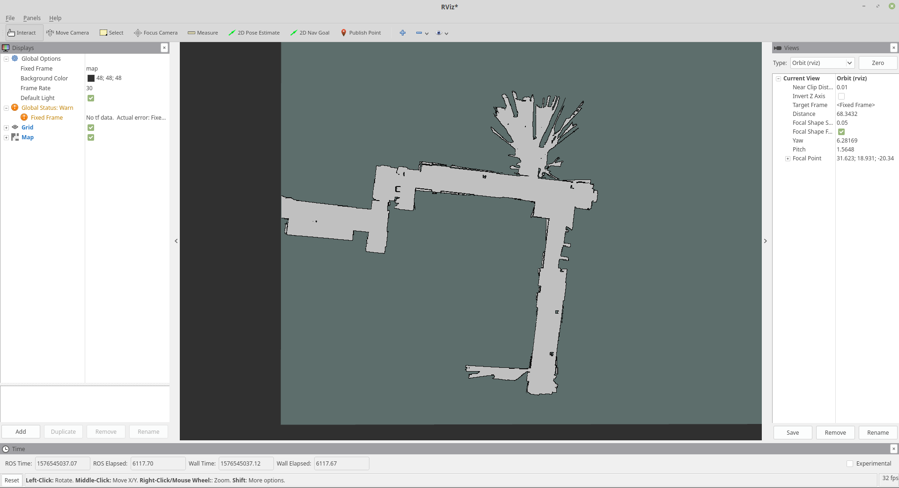

## 算法实现(1,2,3)
### 程序说明
1. 为每个算法新建了`pMap1`, `pMap2`, `pMap3`与覆盖栅格建图算法、计数建图算法、 TSDF建图算法对应, 原pMap只作为一个指针, 在Publish时选取对应算法的结果进行publish.
    ```c++
    // file occupany_mapping.h
    unsigned char *pMap;
    std::vector<unsigned char> pMap1;
    std::vector<unsigned char> pMap2;
    std::vector<unsigned char> pMap3;
    ```

    ```c++
    // 选择publish的地图
    pMap = pMap2.data();
    PublishMap(mapPub);
    ```

2. 在构图时将同时运行三个算法, 并将结果分别保存到`pMap1`, `pMap2`, `pMap3`之中.

3. 为了使得三种算法能够同时运行, 对TraceLine做了如下修改:
    * 对返回值GridIndex按照(x0,y0) -> (x1, y1)的顺序进行, 原来是较小的x到较大x.
    * 返回的grids中不包含(x1, y1), 原来是不包含较大的x值的端点. 应为做了swap.
    ```c++
    int x1_ori = x1;
    int y1_ori = y1;
        
    bool reverse_order = x0 > x1;
    if (reverse_order)
    {
        std::swap(x0, x1);
        std::swap(y0, y1);
    }        
    //不包含最后一个点．
    if (pointX == x1_ori && pointY == y1_ori)
        continue;
    
    // order from x0 to x1
    if(reverse_order) {
        for(int i=0; i<gridIndexVector.size()/2; ++i)
        {
            std::swap(gridIndexVector[i], gridIndexVector[gridIndexVector.size()-1-i]);
        }
    }    
    ```

4. 在更新tsdf时将原来的dis做了延长, 经过3的修改, 可以找到算法1,2所该访问的临界index.
    ```c++
    double ext_dist = dist+0.1; // extend dist for tsdf update
    double ext_x = ext_dist * cos(angle);
    double ext_y = ext_dist * sin(angle);
    double ext_world_x = cos(theta) * ext_x - sin(theta) * ext_y + robotPose(0);
    double ext_world_y = sin(theta) * ext_x + cos(theta) * ext_y + robotPose(1);

    GridIndex endIndex3 = ConvertWorld2GridIndex(ext_world_x, ext_world_y);
    GridIndex endIndex12 = ConvertWorld2GridIndex(world_x, world_y); // end index for alg1 and alg2
    
    // 0表示free, 1表示已经访问过最后一个free的珊格， 当下珊格为障碍物, 2表示已经访问过障碍物, 进入unknow
    bool finish12 = 0;
    for(const auto &gd : grids) {
        if(finish12==0) { // miss or free cell
            ...
            if(gd.x == endIndex12.x && gd.y == endIndex12.y) { // 当下为最后一个free的珊格
                finish12 = 1;
            }
        }
        else if(finish12==1) { // last occ or hit cell
            ...
            finish12 = 2;
        }
    }
    ```
### 程序运行截图
覆盖栅格建图算法


计数建图算法


TSDF建图算法


## 4. 总结比较这3种建图算法的优劣
计数建图算法: 最简单容易实现, 传感器miss和hit完全相当的, 计算复杂度低. 精度而言也是最差的.
覆盖栅格建图算法: 考虑逆观测模型, 通过$l_{occ}$和$l_{free}$的来表示一次扫描到occ或free对该栅格的贡献. 实现复杂度和计算复杂度与计数建图相当, 精度更好.
TSDF: 充分考虑传感器测量的不确定性，利用多次测量数据来实现更精确的表面重构，从而得到更精确、更细、更薄的地图. 实现和计算复杂度相对与前两者高, 建图最精确.
