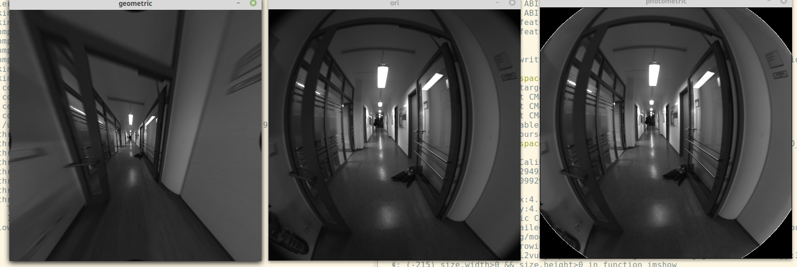

## DSO 第一次课作业
### 作业一：代码
1.补全`photometric.cpp`文件中的代码完成对图像的光度的矫正。
2.参考DSO代码，完成 `geometry.cpp`中代码，求出矫正后的相机内参，并对data中图像进行矫正。

效果:

### 作业二:
ORB-SLAM2和DSO初始化对比.
* 算法原理
    * ORB-SLAM2, 根据匹配的特征点, 利用极对几何和单应性, 计算F(对应translation比较大时)和H(对应于纯旋转时). 然后根据重投影内点数量选取最优的模型, 计算RT.

    * DSO, 选取一些带有梯度且分布均匀的点, 通过优化光度误差计算RT(RT初始化为单位阵), 当相邻两帧出现足够大的位移, 且接下来5帧都正常, 则初始化成功.

* 初始化速度
    ORB-SLAM2初始化步骤: 提取特征点, 求解F/H, 分解F/H得到RT, 很快.
    DSO速度慢.

* 初始化条件严格程度, 适用环境
    * DSO 初始化速度慢, 且偶尔会失败, 在初始化时需要相机缓慢平移, 条件苛刻.
        > The current initializer is not very good... it is very slow and occasionally fails. Make sure, the initial camera motion is slow and "nice" (i.e., a lot of translation and little rotation) during initialization. Possibly replace by your own initializer.
    * ORB-SLAM2 只要求相机有一定大小的位姿变化(旋转和平移均可), 条件宽松.