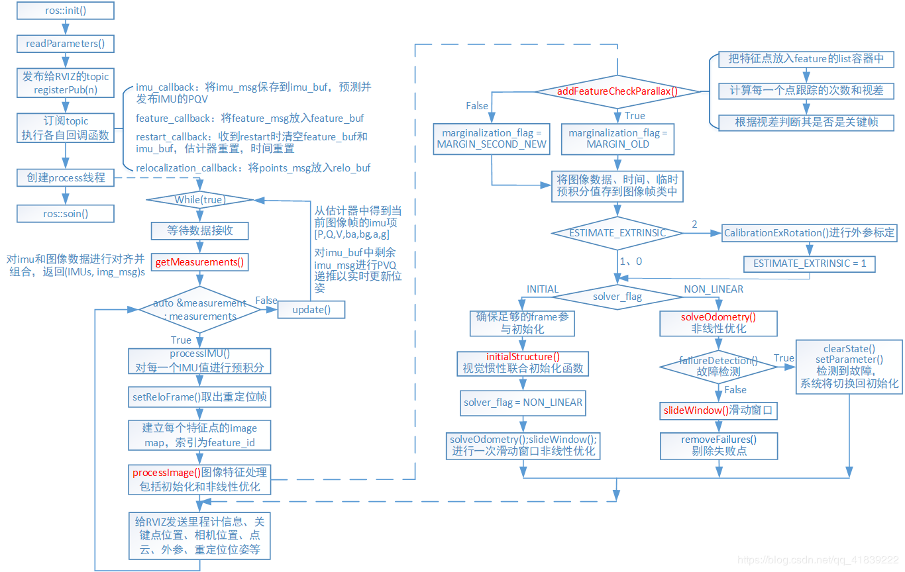

## ROS Helloworld
ros topic 消息demo:


## 流程图
1. feature_track
    
2. vins_estimator
    

## MH05相邻两帧图像的特征点跟踪情况
```bash
[ INFO] [1587307864.365109986]: [wegatron INFO] track pts: (-1, 1) (-1, 1) (-1, 1) (-1, 1) (-1, 1) (-1, 1) (-1, 1) (-1, 1) (-1, 1) (-1, 1) (-1, 1) (-1, 1) (-1, 1) (-1, 1) (-1, 1) (-1, 1) (-1, 1) (-1, 1) (-1, 1) (-1, 1) (-1, 1) (-1, 1) (-1, 1) (-1, 1) (-1, 1) (-1, 1) (-1, 1) (-1, 1) (-1, 1) (-1, 1) (-1, 1) (-1, 1) (-1, 1) (-1, 1) (-1, 1) (-1, 1) (-1, 1) (-1, 1) (-1, 1) (-1, 1) (-1, 1) (-1, 1) (-1, 1) (-1, 1) (-1, 1) (-1, 1) (-1, 1) (-1, 1) (-1, 1) (-1, 1) (-1, 1) (-1, 1) (-1, 1) (-1, 1) (-1, 1) (-1, 1) (-1, 1) (-1, 1) (-1, 1) (-1, 1) (-1, 1) (-1, 1) (-1, 1) (-1, 1) (-1, 1) (-1, 1) (-1, 1) (-1, 1) (-1, 1) (-1, 1) (-1, 1) (-1, 1) (-1, 1) (-1, 1) (-1, 1) (-1, 1) (-1, 1) (-1, 1) (-1, 1) (-1, 1) (-1, 1) (-1, 1) (-1, 1) (-1, 1) (-1, 1) (-1, 1) (-1, 1) (-1, 1) (-1, 1) (-1, 1) (-1, 1) (-1, 1) (-1, 1) (-1, 1) (-1, 1) (-1, 1) (-1, 1) (-1, 1) (-1, 1) (-1, 1) (-1, 1) (-1, 1) (-1, 1) (-1, 1) (-1, 1) (-1, 1) (-1, 1) (-1, 1) (-1, 1) (-1, 1) (-1, 1) (-1, 1) (-1, 1) (-1, 1) (-1, 1) (-1, 1) (-1, 1) (-1, 1) (-1, 1) (-1, 1) (-1, 1) (-1, 1) (-1, 1) (-1, 1) (-1, 1) (-1, 1) (-1, 1) (-1, 1) (-1, 1) (-1, 1) (-1, 1) (-1, 1) (-1, 1) (-1, 1) (-1, 1) (-1, 1) (-1, 1) (-1, 1) (-1, 1) (-1, 1) (-1, 1) (-1, 1) (-1, 1) (-1, 1) (-1, 1) (-1, 1) (-1, 1) (-1, 1) (-1, 1) (-1, 1) 
[ INFO] [1587307864.368703830]: whole feature tracker processing costs: 25.365657
[ INFO] [1587307864.391458267]: [wegatron]
[ INFO] [1587307864.402731001]: [wegatron INFO] track pts: (0, 2) (1, 2) (2, 2) (3, 2) (4, 2) (5, 2) (6, 2) (7, 2) (8, 2) (9, 2) (10, 2) (11, 2) (12, 2) (13, 2) (14, 2) (15, 2) (16, 2) (17, 2) (18, 2) (19, 2) (20, 2) (21, 2) (22, 2) (23, 2) (24, 2) (25, 2) (26, 2) (27, 2) (28, 2) (29, 2) (30, 2) (31, 2) (32, 2) (33, 2) (34, 2) (35, 2) (36, 2) (37, 2) (38, 2) (39, 2) (40, 2) (41, 2) (42, 2) (43, 2) (44, 2) (45, 2) (46, 2) (47, 2) (48, 2) (49, 2) (50, 2) (51, 2) (52, 2) (53, 2) (54, 2) (55, 2) (56, 2) (57, 2) (58, 2) (59, 2) (60, 2) (61, 2) (62, 2) (63, 2) (64, 2) (65, 2) (66, 2) (67, 2) (68, 2) (69, 2) (70, 2) (71, 2) (72, 2) (73, 2) (74, 2) (75, 2) (76, 2) (77, 2) (78, 2) (79, 2) (80, 2) (81, 2) (82, 2) (83, 2) (84, 2) (85, 2) (86, 2) (87, 2) (88, 2) (89, 2) (90, 2) (91, 2) (92, 2) (93, 2) (94, 2) (95, 2) (96, 2) (97, 2) (98, 2) (99, 2) (100, 2) (101, 2) (102, 2) (103, 2) (104, 2) (105, 2) (106, 2) (107, 2) (108, 2) (109, 2) (110, 2) (111, 2) (112, 2) (113, 2) (114, 2) (115, 2) (116, 2) (117, 2) (118, 2) (119, 2) (120, 2) (121, 2) (122, 2) (123, 2) (124, 2) (125, 2) (126, 2) (127, 2) (128, 2) (129, 2) (130, 2) (131, 2) (132, 2) (133, 2) (134, 2) (135, 2) (136, 2) (137, 2) (138, 2) (139, 2) (140, 2) (141, 2) (142, 2) (143, 2) (144, 2) (145, 2) (146, 2) (147, 2) (148, 2) (149, 2) 
[ INFO] [1587307864.402834304]: whole feature tracker processing costs: 11.279648
[ INFO] [1587307864.452229871]: [wegatron]
[ INFO] [1587307864.470656976]: [wegatron INFO] track pts: (104, 3) (95, 3) (96, 3) (97, 3) (98, 3) (99, 3) (100, 3) (101, 3) (102, 3) (103, 3) (94, 3) (105, 3) (106, 3) (107, 3) (108, 3) (109, 3) (110, 3) (111, 3) (112, 3) (85, 3) (76, 3) (77, 3) (78, 3) (79, 3) (80, 3) (81, 3) (82, 3) (83, 3) (84, 3) (113, 3) (86, 3) (87, 3) (88, 3) (89, 3) (90, 3) (91, 3) (92, 3) (93, 3) (141, 3) (132, 3) (133, 3) (134, 3) (135, 3) (136, 3) (137, 3) (138, 3) (139, 3) (140, 3) (131, 3) (142, 3) (143, 3) (144, 3) (145, 3) (146, 3) (147, 3) (148, 3) (149, 3) (122, 3) (114, 3) (115, 3) (116, 3) (117, 3) (118, 3) (119, 3) (120, 3) (121, 3) (75, 3) (123, 3) (124, 3) (125, 3) (126, 3) (127, 3) (128, 3) (129, 3) (130, 3) (29, 3) (20, 3) (21, 3) (22, 3) (23, 3) (24, 3) (25, 3) (26, 3) (27, 3) (28, 3) (19, 3) (30, 3) (31, 3) (32, 3) (33, 3) (34, 3) (35, 3) (36, 3) (37, 3) (10, 3) (1, 3) (2, 3) (3, 3) (4, 3) (5, 3) (6, 3) (7, 3) (8, 3) (9, 3) (38, 3) (11, 3) (12, 3) (13, 3) (14, 3) (15, 3) (16, 3) (17, 3) (18, 3) (66, 3) (57, 3) (58, 3) (59, 3) (60, 3) (61, 3) (62, 3) (63, 3) (64, 3) (65, 3) (56, 3) (68, 3) (69, 3) (70, 3) (71, 3) (72, 3) (73, 3) (74, 3) (47, 3) (39, 3) (40, 3) (41, 3) (42, 3) (43, 3) (44, 3) (45, 3) (46, 3) (0, 3) (48, 3) (49, 3) (50, 3) (51, 3) (52, 3) (53, 3) (54, 3) (55, 3) (-1, 1) 
[ INFO] [1587307864.473026659]: whole feature tracker processing costs: 20.651107
[ INFO] [1587307864.501963586]: [wegatron]
[ INFO] [1587307864.506325112]: [wegatron INFO] track pts: (104, 4) (95, 4) (96, 4) (97, 4) (98, 4) (99, 4) (100, 4) (101, 4) (102, 4) (103, 4) (94, 4) (105, 4) (106, 4) (107, 4) (108, 4) (109, 4) (110, 4) (111, 4) (112, 4) (85, 4) (76, 4) (77, 4) (78, 4) (79, 4) (80, 4) (81, 4) (82, 4) (83, 4) (84, 4) (113, 4) (86, 4) (87, 4) (88, 4) (89, 4) (90, 4) (91, 4) (92, 4) (93, 4) (141, 4) (132, 4) (133, 4) (134, 4) (135, 4) (136, 4) (137, 4) (138, 4) (139, 4) (140, 4) (131, 4) (142, 4) (143, 4) (144, 4) (145, 4) (146, 4) (147, 4) (148, 4) (149, 4) (122, 4) (114, 4) (115, 4) (116, 4) (117, 4) (118, 4) (119, 4) (120, 4) (121, 4) (75, 4) (123, 4) (124, 4) (125, 4) (126, 4) (127, 4) (128, 4) (129, 4) (130, 4) (29, 4) (20, 4) (21, 4) (22, 4) (23, 4) (24, 4) (25, 4) (26, 4) (27, 4) (28, 4) (19, 4) (30, 4) (31, 4) (32, 4) (33, 4) (34, 4) (35, 4) (36, 4) (37, 4) (10, 4) (1, 4) (2, 4) (3, 4) (4, 4) (5, 4) (6, 4) (7, 4) (8, 4) (9, 4) (38, 4) (11, 4) (12, 4) (13, 4) (14, 4) (15, 4) (16, 4) (17, 4) (18, 4) (66, 4) (57, 4) (58, 4) (59, 4) (60, 4) (61, 4) (62, 4) (63, 4) (64, 4) (65, 4) (56, 4) (68, 4) (69, 4) (70, 4) (71, 4) (72, 4) (73, 4) (74, 4) (47, 4) (39, 4) (40, 4) (41, 4) (42, 4) (43, 4) (44, 4) (45, 4) (46, 4) (0, 4) (48, 4) (49, 4) (50, 4) (51, 4) (52, 4) (53, 4) (54, 4) (55, 4) (150, 2) 
[ INFO] [1587307864.506485052]: whole feature tracker processing costs: 4.426368
[ INFO] [1587307864.541197243]: [wegatron]
[ INFO] [1587307864.546094936]: [wegatron INFO] track pts: (9, 5) (10, 5) (1, 5) (2, 5) (3, 5) (4, 5) (5, 5) (6, 5) (7, 5) (8, 5) (37, 5) (38, 5) (11, 5) (12, 5) (13, 5) (14, 5) (15, 5) (16, 5) (17, 5) (28, 5) (29, 5) (20, 5) (21, 5) (22, 5) (23, 5) (24, 5) (25, 5) (26, 5) (27, 5) (18, 5) (19, 5) (30, 5) (31, 5) (32, 5) (33, 5) (34, 5) (35, 5) (36, 5) (0, 5) (47, 5) (39, 5) (40, 5) (41, 5) (42, 5) (43, 5) (44, 5) (45, 5) (46, 5) (74, 5) (48, 5) (49, 5) (50, 5) (51, 5) (52, 5) (53, 5) (54, 5) (55, 5) (64, 5) (66, 5) (57, 5) (58, 5) (59, 5) (60, 5) (61, 5) (62, 5) (63, 5) (95, 5) (65, 5) (56, 5) (68, 5) (69, 5) (70, 5) (71, 5) (72, 5) (73, 5) (84, 5) (85, 5) (76, 5) (77, 5) (78, 5) (79, 5) (80, 5) (81, 5) (82, 5) (83, 5) (112, 5) (113, 5) (86, 5) (87, 5) (88, 5) (89, 5) (90, 5) (91, 5) (92, 5) (103, 5) (104, 5) (96, 5) (97, 5) (98, 5) (99, 5) (100, 5) (101, 5) (102, 5) (129, 5) (94, 5) (105, 5) (106, 5) (107, 5) (108, 5) (109, 5) (110, 5) (111, 5) (121, 5) (149, 5) (122, 5) (114, 5) (115, 5) (116, 5) (117, 5) (118, 5) (119, 5) (120, 5) (141, 5) (75, 5) (123, 5) (124, 5) (125, 5) (126, 5) (127, 5) (128, 5) (130, 5) (147, 5) (93, 5) (132, 5) (133, 5) (134, 5) (135, 5) (136, 5) (137, 5) (138, 5) (139, 5) (140, 5) (131, 5) (142, 5) (143, 5) (144, 5) (145, 5) (146, 5) (148, 5) (150, 3) 
[ INFO] [1587307864.547671372]: whole feature tracker processing costs: 6.372866
[ INFO] [1587307864.602563488]: [wegatron]
[ INFO] [1587307864.607138282]: [wegatron INFO] track pts: (9, 6) (10, 6) (1, 6) (2, 6) (3, 6) (4, 6) (5, 6) (6, 6) (7, 6) (8, 6) (37, 6) (38, 6) (11, 6) (12, 6) (13, 6) (14, 6) (15, 6) (16, 6) (17, 6) (28, 6) (29, 6) (20, 6) (21, 6) (22, 6) (23, 6) (24, 6) (25, 6) (26, 6) (27, 6) (18, 6) (19, 6) (30, 6) (31, 6) (32, 6) (33, 6) (34, 6) (35, 6) (36, 6) (0, 6) (47, 6) (39, 6) (40, 6) (41, 6) (42, 6) (43, 6) (44, 6) (45, 6) (46, 6) (74, 6) (48, 6) (49, 6) (50, 6) (51, 6) (52, 6) (53, 6) (54, 6) (55, 6) (64, 6) (66, 6) (57, 6) (58, 6) (59, 6) (60, 6) (61, 6) (62, 6) (63, 6) (95, 6) (65, 6) (56, 6) (68, 6) (69, 6) (70, 6) (71, 6) (72, 6) (73, 6) (84, 6) (85, 6) (76, 6) (77, 6) (78, 6) (79, 6) (80, 6) (81, 6) (82, 6) (83, 6) (112, 6) (113, 6) (86, 6) (87, 6) (88, 6) (89, 6) (90, 6) (91, 6) (92, 6) (103, 6) (104, 6) (96, 6) (97, 6) (98, 6) (99, 6) (100, 6) (101, 6) (102, 6) (129, 6) (94, 6) (105, 6) (106, 6) (107, 6) (108, 6) (109, 6) (110, 6) (111, 6) (121, 6) (149, 6) (122, 6) (114, 6) (115, 6) (116, 6) (117, 6) (118, 6) (119, 6) (120, 6) (141, 6) (75, 6) (123, 6) (124, 6) (125, 6) (126, 6) (127, 6) (128, 6) (130, 6) (147, 6) (93, 6) (132, 6) (133, 6) (134, 6) (135, 6) (136, 6) (137, 6) (138, 6) (139, 6) (140, 6) (131, 6) (142, 6) (143, 6) (144, 6) (145, 6) (146, 6) (148, 6) (150, 4) 
[ INFO] [1587307864.607439179]: whole feature tracker processing costs: 4.744092
[ INFO] [1587307864.641155808]: [wegatron]
[ INFO] [1587307864.646466909]: [wegatron INFO] track pts: (129, 7) (103, 7) (104, 7) (96, 7) (97, 7) (98, 7) (99, 7) (100, 7) (101, 7) (102, 7) (92, 7) (94, 7) (105, 7) (106, 7) (107, 7) (108, 7) (109, 7) (110, 7) (111, 7) (83, 7) (84, 7) (85, 7) (76, 7) (77, 7) (78, 7) (79, 7) (80, 7) (81, 7) (82, 7) (121, 7) (112, 7) (113, 7) (86, 7) (87, 7) (88, 7) (89, 7) (90, 7) (91, 7) (139, 7) (147, 7) (93, 7) (132, 7) (133, 7) (134, 7) (135, 7) (136, 7) (137, 7) (138, 7) (130, 7) (140, 7) (131, 7) (142, 7) (143, 7) (144, 7) (145, 7) (146, 7) (148, 7) (120, 7) (149, 7) (122, 7) (114, 7) (115, 7) (116, 7) (117, 7) (118, 7) (119, 7) (10, 7) (141, 7) (75, 7) (123, 7) (124, 7) (125, 7) (126, 7) (127, 7) (128, 7) (27, 7) (28, 7) (29, 7) (20, 7) (21, 7) (22, 7) (23, 7) (24, 7) (25, 7) (26, 7) (17, 7) (18, 7) (19, 7) (30, 7) (31, 7) (32, 7) (33, 7) (34, 7) (35, 7) (8, 7) (9, 7) (1, 7) (2, 7) (3, 7) (4, 7) (5, 7) (6, 7) (7, 7) (72, 7) (37, 7) (38, 7) (11, 7) (12, 7) (13, 7) (14, 7) (15, 7) (16, 7) (63, 7) (55, 7) (64, 7) (66, 7) (57, 7) (58, 7) (59, 7) (60, 7) (61, 7) (62, 7) (0, 7) (95, 7) (65, 7) (56, 7) (68, 7) (69, 7) (70, 7) (71, 7) (73, 7) (53, 7) (36, 7) (47, 7) (39, 7) (40, 7) (41, 7) (42, 7) (43, 7) (44, 7) (45, 7) (46, 7) (74, 7) (48, 7) (49, 7) (50, 7) (51, 7) (52, 7) (54, 7) (150, 5) 
[ INFO] [1587307864.648101534]: whole feature tracker processing costs: 6.857529
[ INFO] [1587307864.695026712]: [wegatron]
[ INFO] [1587307864.713451906]: [wegatron INFO] track pts: (129, 8) (103, 8) (104, 8) (96, 8) (97, 8) (98, 8) (99, 8) (100, 8) (101, 8) (102, 8) (92, 8) (94, 8) (105, 8) (106, 8) (107, 8) (108, 8) (109, 8) (110, 8) (111, 8) (83, 8) (84, 8) (85, 8) (76, 8) (77, 8) (78, 8) (79, 8) (80, 8) (81, 8) (82, 8) (121, 8) (112, 8) (113, 8) (86, 8) (87, 8) (88, 8) (89, 8) (90, 8) (91, 8) (139, 8) (147, 8) (93, 8) (132, 8) (133, 8) (134, 8) (135, 8) (136, 8) (137, 8) (138, 8) (130, 8) (140, 8) (131, 8) (142, 8) (143, 8) (144, 8) (145, 8) (146, 8) (148, 8) (120, 8) (149, 8) (122, 8) (114, 8) (115, 8) (116, 8) (117, 8) (118, 8) (119, 8) (10, 8) (141, 8) (75, 8) (123, 8) (124, 8) (125, 8) (126, 8) (127, 8) (128, 8) (27, 8) (28, 8) (29, 8) (20, 8) (21, 8) (22, 8) (23, 8) (24, 8) (25, 8) (26, 8) (17, 8) (18, 8) (19, 8) (30, 8) (31, 8) (32, 8) (33, 8) (34, 8) (35, 8) (8, 8) (9, 8) (1, 8) (2, 8) (3, 8) (4, 8) (5, 8) (6, 8) (7, 8) (72, 8) (37, 8) (38, 8) (11, 8) (12, 8) (13, 8) (14, 8) (15, 8) (16, 8) (63, 8) (55, 8) (64, 8) (66, 8) (57, 8) (58, 8) (59, 8) (60, 8) (61, 8) (62, 8) (0, 8) (95, 8) (65, 8) (56, 8) (68, 8) (69, 8) (70, 8) (71, 8) (73, 8) (53, 8) (36, 8) (47, 8) (39, 8) (40, 8) (41, 8) (42, 8) (43, 8) (44, 8) (45, 8) (46, 8) (74, 8) (48, 8) (49, 8) (50, 8) (51, 8) (52, 8) (54, 8) (150, 6) 
[ INFO] [1587307864.714026360]: whole feature tracker processing costs: 18.900629
[ INFO] [1587307864.741348130]: [wegatron]
[ INFO] [1587307864.746648303]: [wegatron INFO] track pts: (72, 9) (8, 9) (9, 9) (1, 9) (2, 9) (3, 9) (4, 9) (5, 9) (6, 9) (7, 9) (35, 9) (37, 9) (38, 9) (11, 9) (12, 9) (13, 9) (14, 9) (15, 9) (16, 9) (26, 9) (27, 9) (28, 9) (29, 9) (20, 9) (21, 9) (22, 9) (23, 9) (24, 9) (25, 9) (63, 9) (17, 9) (18, 9) (19, 9) (30, 9) (31, 9) (32, 9) (33, 9) (34, 9) (45, 9) (53, 9) (36, 9) (47, 9) (39, 9) (40, 9) (41, 9) (42, 9) (43, 9) (44, 9) (73, 9) (46, 9) (74, 9) (48, 9) (49, 9) (50, 9) (51, 9) (52, 9) (54, 9) (62, 9) (55, 9) (64, 9) (66, 9) (57, 9) (58, 9) (59, 9) (60, 9) (61, 9) (103, 9) (0, 9) (95, 9) (65, 9) (56, 9) (68, 9) (69, 9) (70, 9) (71, 9) (82, 9) (83, 9) (84, 9) (85, 9) (76, 9) (77, 9) (78, 9) (79, 9) (80, 9) (81, 9) (111, 9) (121, 9) (112, 9) (113, 9) (86, 9) (87, 9) (88, 9) (89, 9) (90, 9) (102, 9) (129, 9) (104, 9) (96, 9) (97, 9) (98, 9) (99, 9) (100, 9) (101, 9) (127, 9) (92, 9) (94, 9) (105, 9) (106, 9) (107, 9) (108, 9) (109, 9) (110, 9) (119, 9) (148, 9) (120, 9) (149, 9) (122, 9) (114, 9) (115, 9) (116, 9) (117, 9) (118, 9) (139, 9) (10, 9) (141, 9) (75, 9) (123, 9) (124, 9) (125, 9) (126, 9) (128, 9) (145, 9) (91, 9) (147, 9) (93, 9) (132, 9) (133, 9) (134, 9) (135, 9) (136, 9) (137, 9) (138, 9) (130, 9) (140, 9) (131, 9) (142, 9) (143, 9) (144, 9) (146, 9) (150, 7) 
[ INFO] [1587307864.749833753]: whole feature tracker processing costs: 8.343145
[ INFO] [1587307864.791222002]: [wegatron]
[ INFO] [1587307864.795813710]: [wegatron INFO] track pts: (72, 10) (8, 10) (9, 10) (1, 10) (2, 10) (3, 10) (4, 10) (5, 10) (6, 10) (7, 10) (35, 10) (37, 10) (38, 10) (11, 10) (12, 10) (13, 10) (14, 10) (15, 10) (16, 10) (26, 10) (27, 10) (28, 10) (29, 10) (20, 10) (21, 10) (22, 10) (23, 10) (24, 10) (25, 10) (63, 10) (17, 10) (18, 10) (19, 10) (30, 10) (31, 10) (32, 10) (33, 10) (34, 10) (45, 10) (53, 10) (36, 10) (47, 10) (39, 10) (40, 10) (41, 10) (42, 10) (43, 10) (44, 10) (73, 10) (46, 10) (74, 10) (48, 10) (49, 10) (50, 10) (51, 10) (52, 10) (54, 10) (62, 10) (55, 10) (64, 10) (66, 10) (57, 10) (58, 10) (59, 10) (60, 10) (61, 10) (103, 10) (0, 10) (95, 10) (65, 10) (56, 10) (68, 10) (69, 10) (70, 10) (71, 10) (82, 10) (83, 10) (84, 10) (85, 10) (76, 10) (77, 10) (78, 10) (79, 10) (80, 10) (81, 10) (111, 10) (121, 10) (112, 10) (113, 10) (86, 10) (87, 10) (88, 10) (89, 10) (90, 10) (102, 10) (129, 10) (104, 10) (96, 10) (97, 10) (98, 10) (99, 10) (100, 10) (101, 10) (127, 10) (92, 10) (94, 10) (105, 10) (106, 10) (107, 10) (108, 10) (109, 10) (110, 10) (119, 10) (148, 10) (120, 10) (149, 10) (122, 10) (114, 10) (115, 10) (116, 10) (117, 10) (118, 10) (139, 10) (10, 10) (141, 10) (75, 10) (123, 10) (124, 10) (125, 10) (126, 10) (128, 10) (145, 10) (91, 10) (147, 10) (93, 10) (132, 10) (133, 10) (134, 10) (135, 10) (136, 10) (137, 10) (138, 10) (130, 10) (140, 10) (131, 10) (142, 10) (143, 10) (144, 10) (146, 10) (150, 8) 
[ INFO] [1587307864.795939662]: whole feature tracker processing costs: 4.452473
```

符合预期, 随着跟踪次数的增加, 大部分点的跟踪次数依次递增.

## 相邻两帧图像间的IMU预积分信息
```bash
[ INFO] [1587367321.441495151]: ------------------ frame_count=0, jacobian---------
1 0 0 0 0 0 0 0 0 0 0 0 0 0 0
0 1 0 0 0 0 0 0 0 0 0 0 0 0 0
0 0 1 0 0 0 0 0 0 0 0 0 0 0 0
0 0 0 1 0 0 0 0 0 0 0 0 0 0 0
0 0 0 0 1 0 0 0 0 0 0 0 0 0 0
0 0 0 0 0 1 0 0 0 0 0 0 0 0 0
0 0 0 0 0 0 1 0 0 0 0 0 0 0 0
0 0 0 0 0 0 0 1 0 0 0 0 0 0 0
0 0 0 0 0 0 0 0 1 0 0 0 0 0 0
0 0 0 0 0 0 0 0 0 1 0 0 0 0 0
0 0 0 0 0 0 0 0 0 0 1 0 0 0 0
0 0 0 0 0 0 0 0 0 0 0 1 0 0 0
0 0 0 0 0 0 0 0 0 0 0 0 1 0 0
0 0 0 0 0 0 0 0 0 0 0 0 0 1 0
0 0 0 0 0 0 0 0 0 0 0 0 0 0 1
-----------imu covariance-------
0 0 0 0 0 0 0 0 0 0 0 0 0 0 0
0 0 0 0 0 0 0 0 0 0 0 0 0 0 0
0 0 0 0 0 0 0 0 0 0 0 0 0 0 0
0 0 0 0 0 0 0 0 0 0 0 0 0 0 0
0 0 0 0 0 0 0 0 0 0 0 0 0 0 0
0 0 0 0 0 0 0 0 0 0 0 0 0 0 0
0 0 0 0 0 0 0 0 0 0 0 0 0 0 0
0 0 0 0 0 0 0 0 0 0 0 0 0 0 0
0 0 0 0 0 0 0 0 0 0 0 0 0 0 0
0 0 0 0 0 0 0 0 0 0 0 0 0 0 0
0 0 0 0 0 0 0 0 0 0 0 0 0 0 0
0 0 0 0 0 0 0 0 0 0 0 0 0 0 0
0 0 0 0 0 0 0 0 0 0 0 0 0 0 0
0 0 0 0 0 0 0 0 0 0 0 0 0 0 0
0 0 0 0 0 0 0 0 0 0 0 0 0 0 0
***************************************
[ INFO] [1587367321.536648151]: ------------------ frame_count=1, jacobian---------
           1            0            0  5.03216e-08   -0.0205549 -4.93588e-05          0.1            0            0  -0.00499974  1.86909e-05  -3.7172e-05  1.98443e-06  0.000697662  1.79624e-05
           0            1            0    0.0205549 -1.57248e-07    0.0515827            0          0.1            0 -1.89349e-05  -0.00499989  2.11026e-05 -0.000687275 -3.79041e-06  -0.00171458
           0            0            1  4.95239e-05   -0.0515825  1.07153e-07            0            0          0.1  3.70482e-05 -2.13206e-05  -0.00499973 -1.51632e-05   0.00171044 -6.07322e-06
           0            0            0     0.999685    0.0117008   -0.0229576            0            0            0            0            0            0   -0.0999903 -0.000556331   0.00110792
           0            0            0   -0.0114157     0.999856    0.0131578            0            0            0            0            0            0  0.000547497   -0.0999957 -0.000630805
           0            0            0    0.0231007   -0.0129049     0.999667            0            0            0            0            0            0  -0.00111233  0.000622967   -0.0999898
           0            0            0  1.59065e-06     -0.41799  -0.00876306            1            0            0   -0.0999891  0.000570102  -0.00113783  7.98119e-05    0.0212501  0.000731943
           0            0            0      0.41799 -4.88666e-06      1.02313            0            1            0 -0.000580028   -0.0999951  0.000639354   -0.0208426 -0.000145244   -0.0508948
           0            0            0   0.00876817     -1.02312  3.30281e-06            0            0            1   0.00113281 -0.000648253   -0.0999886  -0.00062359    0.0507287 -0.000236751
           0            0            0            0            0            0            0            0            0            1            0            0            0            0            0
           0            0            0            0            0            0            0            0            0            0            1            0            0            0            0
           0            0            0            0            0            0            0            0            0            0            0            1            0            0            0
           0            0            0            0            0            0            0            0            0            0            0            0            1            0            0
           0            0            0            0            0            0            0            0            0            0            0            0            0            1            0
           0            0            0            0            0            0            0            0            0            0            0            0            0            0            1
-----------imu covariance-------
 5.33037e-09 -1.78181e-14  8.53855e-13 -3.07756e-13 -2.79095e-11  -4.5563e-13  8.00091e-08 -5.19021e-13  2.12126e-11 -1.23488e-15  7.23198e-18 -1.43978e-17  1.46387e-21  3.18929e-19  1.24169e-20
-1.78181e-14  5.33248e-09  7.29603e-15  2.63233e-11  5.81671e-13   6.9037e-11 -7.41284e-13  8.00614e-08  3.02529e-13 -7.34583e-18 -1.23495e-15  8.10733e-18 -3.11231e-19 -2.75729e-21 -7.72486e-19
 8.53855e-13  7.29603e-15  5.33214e-09  1.52013e-14 -6.84146e-11  9.01737e-13  2.16623e-11  2.17388e-13  8.00526e-08    1.434e-17 -8.20952e-18 -1.23487e-15 -1.03439e-20  7.69411e-19 -4.47295e-21
-3.07756e-13  2.63233e-11  1.52013e-14  4.00008e-09 -2.93181e-14 -1.45906e-14 -9.18258e-12  8.03004e-10  9.41833e-12            0            0            0 -9.49962e-17 -3.27273e-19  6.59727e-19
-2.79095e-11  5.81671e-13 -6.84146e-11 -2.93181e-14  4.00004e-09 -2.58874e-14 -8.50168e-10  1.69963e-11 -2.02914e-09            0            0            0   3.2352e-19 -9.49985e-17 -3.77242e-19
 -4.5563e-13   6.9037e-11  9.01737e-13 -1.45906e-14 -2.58874e-14  4.00008e-09 -2.21923e-11  2.04801e-09  2.69509e-11            0            0            0 -6.61591e-19  3.73936e-19  -9.4996e-17
 8.00091e-08 -7.41284e-13  2.16623e-11 -9.18258e-12 -8.50168e-10 -2.21923e-11  1.60024e-06  -2.0971e-11  5.73553e-10 -3.79937e-14  2.95153e-16 -5.90136e-16  7.59449e-20  1.32388e-17  4.93173e-19
-5.19021e-13  8.00614e-08  2.17388e-13  8.03004e-10  1.69963e-11  2.04801e-09  -2.0971e-11  1.60162e-06  8.76827e-12 -3.00944e-16 -3.79972e-14  3.29876e-16 -1.28553e-17 -1.34826e-19 -3.13071e-17
 2.12126e-11  3.02529e-13  8.00526e-08  9.41833e-12 -2.02914e-09  2.69509e-11  5.73553e-10  8.76827e-12  1.60138e-06  5.87206e-16 -3.35073e-16 -3.79934e-14 -3.90851e-19  3.11498e-17 -2.21121e-19
-1.23488e-15 -7.34583e-18    1.434e-17            0            0            0 -3.79937e-14 -3.00944e-16  5.87206e-16  8.00002e-13            0            0            0            0            0
 7.23198e-18 -1.23495e-15 -8.20952e-18            0            0            0  2.95153e-16 -3.79972e-14 -3.35073e-16            0  8.00002e-13            0            0            0            0
-1.43978e-17  8.10733e-18 -1.23487e-15            0            0            0 -5.90136e-16  3.29876e-16 -3.79934e-14            0            0  8.00002e-13            0            0            0
 1.46387e-21 -3.11231e-19 -1.03439e-20 -9.49962e-17   3.2352e-19 -6.61591e-19  7.59449e-20 -1.28553e-17 -3.90851e-19            0            0            0  2.00001e-15            0            0
 3.18929e-19 -2.75729e-21  7.69411e-19 -3.27273e-19 -9.49985e-17  3.73936e-19  1.32388e-17 -1.34826e-19  3.11498e-17            0            0            0            0  2.00001e-15            0
 1.24169e-20 -7.72486e-19 -4.47295e-21  6.59727e-19 -3.77242e-19  -9.4996e-17  4.93173e-19 -3.13071e-17 -2.21121e-19            0            0            0            0            0  2.00001e-15
***************************************
[ INFO] [1587367321.643813297]: ------------------ frame_count=2, jacobian---------
           1            0            0  2.85169e-08   -0.0196483  0.000870838    0.0999999            0            0  -0.00499986  1.78306e-05  -2.4178e-05  1.97733e-06  0.000645008 -3.27008e-05
           0            1            0    0.0196482 -9.04503e-08    0.0490346            0    0.0999999            0  -1.7977e-05  -0.00499987  2.16151e-05 -0.000638177 -3.88199e-06  -0.00163187
           0            0            1 -0.000870739   -0.0490345  6.20672e-08            0            0    0.0999999  2.40549e-05 -2.17371e-05  -0.00499984  3.51369e-05   0.00162905 -5.57535e-06
           0            0            0     0.999893    0.0124154  -0.00860736            0            0            0            0            0            0   -0.0999969  -0.00064429  0.000217589
           0            0            0   -0.0122904      0.99982    0.0150818            0            0            0            0            0            0   0.00064173   -0.0999937 -0.000786746
           0            0            0   0.00878353   -0.0149791     0.999858            0            0            0            0            0            0 -0.000223664  0.000784632   -0.0999957
           0            0            0  7.41209e-07    -0.388857    0.0174997            1            0            0   -0.0999954  0.000560546 -0.000629847  7.88253e-05    0.0192307 -0.000970097
           0            0            0     0.388855 -2.38658e-06     0.974441            0            1            0 -0.000565844   -0.0999945  0.000676189   -0.0189873 -0.000152071   -0.0485033
           0            0            0   -0.0174971    -0.974441  1.64954e-06            0            0            1  0.000624495   -0.0006806   -0.0999944    0.0010675    0.0484014 -0.000220244
           0            0            0            0            0            0            0            0            0            1            0            0            0            0            0
           0            0            0            0            0            0            0            0            0            0            1            0            0            0            0
           0            0            0            0            0            0            0            0            0            0            0            1            0            0            0
           0            0            0            0            0            0            0            0            0            0            0            0            1            0            0
           0            0            0            0            0            0            0            0            0            0            0            0            0            1            0
           0            0            0            0            0            0            0            0            0            0            0            0            0            0            1
-----------imu covariance-------
 5.33027e-09   3.7267e-14  7.58805e-13 -3.30872e-13 -2.57816e-11  1.60425e-12  8.00072e-08   9.1023e-13  1.88081e-11 -1.23494e-15  6.98758e-18 -8.43452e-18  1.46312e-21  2.89696e-19  -1.4188e-20
  3.7267e-14  5.33218e-09 -1.47723e-14  2.52409e-11  6.65715e-13  6.53835e-11   8.7901e-13  8.00546e-08 -3.48158e-13 -7.05197e-18 -1.23493e-15  8.38689e-18 -2.85192e-19 -2.82991e-21 -7.34905e-19
 7.58805e-13 -1.47723e-14  5.33188e-09 -2.02687e-12 -6.51395e-11  9.65407e-13  1.88449e-11 -3.61163e-13  8.00472e-08  8.37575e-18 -8.44076e-18 -1.23493e-15  1.60358e-20  7.33037e-19 -4.10728e-21
-3.30872e-13  2.52409e-11 -2.02687e-12  4.00001e-09 -6.07836e-15 -2.16315e-14 -9.85631e-12  7.52658e-10 -5.92632e-11            0            0            0 -9.49984e-17 -4.03331e-19  7.29307e-20
-2.57816e-11  6.65715e-13 -6.51395e-11 -6.07836e-15  4.00004e-09 -5.16484e-15 -7.68738e-10  1.97472e-11 -1.93545e-09            0            0            0  4.02568e-19 -9.49967e-17 -4.98252e-19
 1.60425e-12  6.53835e-11  9.65407e-13 -2.16315e-14 -5.16484e-15  4.00002e-09   4.6746e-11  1.94271e-09  2.86925e-11            0            0            0 -7.57501e-20  4.97625e-19 -9.49978e-17
 8.00072e-08   8.7901e-13  1.88449e-11 -9.85631e-12 -7.68738e-10   4.6746e-11   1.6002e-06  2.29712e-11  4.97965e-10 -3.79973e-14   2.9458e-16 -2.97856e-16   7.5016e-20  1.18413e-17 -6.18472e-19
  9.1023e-13  8.00546e-08 -3.61163e-13  7.52658e-10  1.97472e-11  1.94271e-09  2.29712e-11  1.60145e-06 -9.11609e-12 -2.97541e-16 -3.79966e-14  3.54505e-16 -1.16376e-17 -1.43096e-19 -2.98344e-17
 1.88081e-11 -3.48158e-13  8.00472e-08 -5.92632e-11 -1.93545e-09  2.86925e-11  4.97965e-10 -9.11609e-12  1.60125e-06  2.94666e-16  -3.5697e-16 -3.79967e-14  7.12314e-19  2.97479e-17 -2.08632e-19
-1.23494e-15 -7.05197e-18  8.37575e-18            0            0            0 -3.79973e-14 -2.97541e-16  2.94666e-16  7.99998e-13            0            0            0            0            0
 6.98758e-18 -1.23493e-15 -8.44076e-18            0            0            0   2.9458e-16 -3.79966e-14  -3.5697e-16            0  7.99998e-13            0            0            0            0
-8.43452e-18  8.38689e-18 -1.23493e-15            0            0            0 -2.97856e-16  3.54505e-16 -3.79967e-14            0            0  7.99998e-13            0            0            0
 1.46312e-21 -2.85192e-19  1.60358e-20 -9.49984e-17  4.02568e-19 -7.57501e-20   7.5016e-20 -1.16376e-17  7.12314e-19            0            0            0        2e-15            0            0
 2.89696e-19 -2.82991e-21  7.33037e-19 -4.03331e-19 -9.49967e-17  4.97625e-19  1.18413e-17 -1.43096e-19  2.97479e-17            0            0            0            0        2e-15            0
 -1.4188e-20 -7.34905e-19 -4.10728e-21  7.29307e-20 -4.98252e-19 -9.49978e-17 -6.18472e-19 -2.98344e-17 -2.08632e-19            0            0            0            0            0        2e-15
***************************************
qt5ct: D-Bus global menu: no
[ INFO] [1587367321.727922570]: ------------------ frame_count=3, jacobian---------
           1            0            0 -2.07728e-08   -0.0183099   0.00110114    0.0999999            0            0  -0.00499981  3.12804e-05  1.13397e-05  3.07817e-06   0.00061486 -3.33066e-05
           0            1            0    0.0183098  6.88802e-08    0.0465993            0    0.0999999            0 -3.11713e-05  -0.00499971  3.00998e-05 -0.000617725  -4.6836e-06  -0.00153978
           0            0            1   -0.0011012   -0.0465995 -4.78733e-08            0            0    0.0999999 -1.16169e-05 -2.99794e-05  -0.00499984  3.79784e-05   0.00154065 -7.91325e-06
           0            0            0     0.999764    0.0199678   0.00990611            0            0            0            0            0            0   -0.0999919 -0.000996587  -0.00055734
           0            0            0   -0.0201174     0.999686     0.016016            0            0            0            0            0            0   0.00100142   -0.0999905 -0.000706429
           0            0            0  -0.00959921   -0.0162015     0.999832            0            0            0            0            0            0  0.000548419  0.000713102   -0.0999948
           0            0            0 -6.94645e-07     -0.36606    0.0234968            1            0            0   -0.0999924    0.0009586  0.000391711  0.000118605    0.0182846  -0.00136575
           0            0            0     0.366056  2.39024e-06     0.927877            0            1            0  -0.00095388   -0.0999889  0.000862987   -0.0184105 -0.000174096   -0.0461413
           0            0            0    -0.023499    -0.927882 -1.68898e-06            0            0            1 -0.000402543 -0.000857497    -0.099994   0.00155819    0.0461754 -0.000301568
           0            0            0            0            0            0            0            0            0            1            0            0            0            0            0
           0            0            0            0            0            0            0            0            0            0            1            0            0            0            0
           0            0            0            0            0            0            0            0            0            0            0            1            0            0            0
           0            0            0            0            0            0            0            0            0            0            0            0            1            0            0
           0            0            0            0            0            0            0            0            0            0            0            0            0            1            0
           0            0            0            0            0            0            0            0            0            0            0            0            0            0            1
-----------imu covariance-------
 5.33026e-09  3.20304e-14  6.80219e-13 -4.79295e-13 -2.45748e-11  1.60461e-12  8.00066e-08  8.03584e-13  1.70056e-11 -1.23491e-15  1.20725e-17  4.74225e-18  2.25604e-21  2.78852e-19 -1.75397e-20
 3.20304e-14  5.33197e-09 -1.27202e-14  2.52067e-11  4.92232e-13  6.13883e-11  1.03645e-12  8.00493e-08 -4.13115e-13 -1.20202e-17 -1.23487e-15  1.10839e-17 -2.81188e-19 -3.14418e-21 -6.93351e-19
 6.80219e-13 -1.27202e-14   5.3317e-09 -2.43666e-12 -6.15912e-11  1.01014e-12  1.69428e-11 -3.18729e-13  8.00426e-08 -4.86804e-18 -1.10247e-17 -1.23493e-15  2.11034e-20  6.94035e-19 -5.54949e-21
-4.79295e-13  2.52067e-11 -2.43666e-12  4.00005e-09   1.6283e-14 -2.98147e-14 -1.41175e-11  7.49914e-10 -8.68042e-11            0            0            0 -9.49962e-17 -6.13823e-19 -3.55145e-19
-2.45748e-11  4.92232e-13 -6.15912e-11   1.6283e-14  4.00006e-09  2.34793e-14 -7.30753e-10  1.48689e-11 -1.84592e-09            0            0            0  6.15964e-19 -9.49958e-17 -4.16104e-19
 1.60461e-12  6.13883e-11  1.01014e-12 -2.98147e-14  2.34793e-14  4.00003e-09  6.17724e-11  1.84017e-09  3.04108e-11            0            0            0  3.51387e-19  4.19205e-19 -9.49977e-17
 8.00066e-08  1.03645e-12  1.69428e-11 -1.41175e-11 -7.30753e-10  6.17724e-11  1.60018e-06  2.85898e-11  4.51172e-10 -3.79955e-14  4.97464e-16  2.14817e-16  1.10353e-19   1.1241e-17 -9.91237e-19
 8.03584e-13  8.00493e-08 -3.18729e-13  7.49914e-10  1.48689e-11  1.84017e-09  2.85898e-11  1.60131e-06 -1.13447e-11 -4.94656e-16 -3.79936e-14   4.3233e-16 -1.13703e-17 -1.50882e-19 -2.84805e-17
 1.70056e-11 -4.13115e-13  8.00426e-08 -8.68042e-11 -1.84592e-09  3.04108e-11  4.51172e-10 -1.13447e-11  1.60113e-06 -2.21048e-16 -4.29012e-16 -3.79965e-14  1.17856e-18  2.85149e-17  -2.7143e-19
-1.23491e-15 -1.20202e-17 -4.86804e-18            0            0            0 -3.79955e-14 -4.94656e-16 -2.21048e-16  7.99998e-13            0            0            0            0            0
 1.20725e-17 -1.23487e-15 -1.10247e-17            0            0            0  4.97464e-16 -3.79936e-14 -4.29012e-16            0  7.99998e-13            0            0            0            0
 4.74225e-18  1.10839e-17 -1.23493e-15            0            0            0  2.14817e-16   4.3233e-16 -3.79965e-14            0            0  7.99998e-13            0            0            0
 2.25604e-21 -2.81188e-19  2.11034e-20 -9.49962e-17  6.15964e-19  3.51387e-19  1.10353e-19 -1.13703e-17  1.17856e-18            0            0            0        2e-15            0            0
 2.78852e-19 -3.14418e-21  6.94035e-19 -6.13823e-19 -9.49958e-17  4.19205e-19   1.1241e-17 -1.50882e-19  2.85149e-17            0            0            0            0        2e-15            0
-1.75397e-20 -6.93351e-19 -5.54949e-21 -3.55145e-19 -4.16104e-19 -9.49977e-17 -9.91237e-19 -2.84805e-17  -2.7143e-19            0            0            0            0            0        2e-15
***************************************
[ INFO] [1587367321.830279996]: ------------------ frame_count=4, jacobian---------
           1            0            0 -2.46589e-08   -0.0174575   0.00202625          0.1            0            0  -0.00499976  4.03392e-05  1.31934e-05  3.79408e-06  0.000579928 -5.30783e-05
           0            1            0    0.0174573  9.71065e-08    0.0461544            0          0.1            0  -4.0239e-05  -0.00499966  2.81141e-05 -0.000583954 -3.22782e-06  -0.00154597
           0            0            1  -0.00202633   -0.0461547 -7.22364e-08            0            0          0.1 -1.35298e-05 -2.79717e-05  -0.00499987  6.09135e-05   0.00154704 -7.27666e-06
           0            0            0     0.999818    0.0195199   0.00245144            0            0            0            0            0            0   -0.0999959 -0.000755104  8.38189e-05
           0            0            0    -0.019553     0.999706    0.0154375            0            0            0            0            0            0  0.000754858   -0.0999928 -0.000677224
           0            0            0  -0.00216542   -0.0154782     0.999885            0            0            0            0            0            0 -9.10738e-05  0.000676987    -0.099997
           0            0            0 -6.05967e-07    -0.344951    0.0347659            1            0            0   -0.0999912   0.00114994  0.000307087  0.000141648    0.0170256  -0.00155165
           0            0            0     0.344946  2.35458e-06     0.926059            0            1            0  -0.00114692   -0.0999872  0.000833895   -0.0171675 -0.000133482   -0.0464025
           0            0            0    -0.034768    -0.926067 -1.74283e-06            0            0            1 -0.000319487  -0.00082974    -0.099995   0.00185062    0.0464357 -0.000284662
           0            0            0            0            0            0            0            0            0            1            0            0            0            0            0
           0            0            0            0            0            0            0            0            0            0            1            0            0            0            0
           0            0            0            0            0            0            0            0            0            0            0            1            0            0            0
           0            0            0            0            0            0            0            0            0            0            0            0            1            0            0
           0            0            0            0            0            0            0            0            0            0            0            0            0            1            0
           0            0            0            0            0            0            0            0            0            0            0            0            0            0            1
-----------imu covariance-------
 5.33028e-09  6.15811e-14  6.45392e-13 -4.48021e-13  -2.3168e-11  2.37564e-12  8.00064e-08  1.48014e-12  1.61682e-11  -1.2349e-15  1.50405e-17  4.36905e-18  2.70551e-21  2.60089e-19 -2.04647e-20
 6.15811e-14  5.33199e-09 -2.32381e-14  2.33535e-11  5.01713e-13  6.18388e-11  1.38621e-12  8.00494e-08 -5.21931e-13  -1.4999e-17 -1.23485e-15  1.07638e-17 -2.62692e-19 -2.48888e-21 -7.01069e-19
 6.45392e-13 -2.32381e-14  5.33175e-09 -3.22448e-12 -6.18385e-11  9.62454e-13  1.58974e-11  -5.4853e-13  8.00434e-08 -4.52069e-18 -1.07059e-17 -1.23495e-15  2.60381e-20   7.0173e-19 -5.34965e-21
-4.48021e-13  2.33535e-11 -3.22448e-12  4.00004e-09  -7.8299e-16 -2.35632e-14 -1.31583e-11  6.85844e-10 -9.42493e-11            0            0            0  -9.4999e-17 -3.83389e-19  1.17987e-19
 -2.3168e-11  5.01713e-13 -6.18385e-11  -7.8299e-16  4.00006e-09  1.03405e-15 -6.80316e-10  1.53573e-11 -1.85637e-09            0            0            0  3.82965e-19 -9.49979e-17 -3.75409e-19
 2.37564e-12  6.18388e-11  9.62454e-13 -2.35632e-14  1.03405e-15  4.00004e-09  6.85336e-11  1.85637e-09  2.88869e-11            0            0            0 -1.20566e-19  3.74976e-19 -9.49992e-17
 8.00064e-08  1.38621e-12  1.58974e-11 -1.31583e-11 -6.80316e-10  6.85336e-11  1.60016e-06  3.62157e-11  4.23748e-10 -3.79953e-14   5.7424e-16  1.33981e-16  1.27596e-19  1.03925e-17 -9.70478e-19
 1.48014e-12  8.00494e-08  -5.4853e-13  6.85844e-10  1.53573e-11  1.85637e-09  3.62157e-11  1.60131e-06 -1.33688e-11 -5.72689e-16 -3.79929e-14  4.25527e-16 -1.05082e-17 -1.29332e-19 -2.86739e-17
 1.61682e-11 -5.21931e-13  8.00434e-08 -9.42493e-11 -1.85637e-09  2.88869e-11  4.23748e-10 -1.33688e-11  1.60115e-06 -1.40961e-16 -4.23426e-16 -3.79973e-14  1.23953e-18  2.86975e-17 -2.64987e-19
 -1.2349e-15  -1.4999e-17 -4.52069e-18            0            0            0 -3.79953e-14 -5.72689e-16 -1.40961e-16  8.00002e-13            0            0            0            0            0
 1.50405e-17 -1.23485e-15 -1.07059e-17            0            0            0   5.7424e-16 -3.79929e-14 -4.23426e-16            0  8.00002e-13            0            0            0            0
 4.36905e-18  1.07638e-17 -1.23495e-15            0            0            0  1.33981e-16  4.25527e-16 -3.79973e-14            0            0  8.00002e-13            0            0            0
 2.70551e-21 -2.62692e-19  2.60381e-20  -9.4999e-17  3.82965e-19 -1.20566e-19  1.27596e-19 -1.05082e-17  1.23953e-18            0            0            0  2.00001e-15            0            0
 2.60089e-19 -2.48888e-21   7.0173e-19 -3.83389e-19 -9.49979e-17  3.74976e-19  1.03925e-17 -1.29332e-19  2.86975e-17            0            0            0            0  2.00001e-15            0
-2.04647e-20 -7.01069e-19 -5.34965e-21  1.17987e-19 -3.75409e-19 -9.49992e-17 -9.70478e-19 -2.86739e-17 -2.64987e-19            0            0            0            0            0  2.00001e-15
***************************************
[ INFO] [1587367321.941257718]: ------------------ frame_count=5, jacobian---------
           1            0            0  2.51139e-08    -0.017722    0.0043976    0.0999999            0            0  -0.00499988  -1.1885e-06 -2.56884e-05  6.40909e-07  0.000615544 -0.000151192
           0            1            0    0.0177221 -1.60597e-08    0.0464752            0    0.0999999            0   1.0463e-06  -0.00499994   1.7989e-05 -0.000609724 -4.62405e-06  -0.00155049
           0            0            1  -0.00439753   -0.0464751 -8.93138e-09            0            0    0.0999999  2.57036e-05 -1.79624e-05  -0.00499983  0.000149465   0.00154794 -4.08577e-06
           0            0            0     0.999835  -0.00399028   -0.0182293            0            0            0            0            0            0   -0.0999939  0.000286509  0.000951679
           0            0            0   0.00417968     0.999936    0.0109133            0            0            0            0            0            0 -0.000292709   -0.0999977 -0.000535369
           0            0            0    0.0181867   -0.0109834     0.999786            0            0            0            0            0            0 -0.000949809  0.000538707   -0.0999926
           0            0            0  8.28047e-07    -0.365566    0.0832233            1            0            0   -0.0999949 -0.000112004 -0.000823586  1.48363e-05    0.0188246  -0.00399644
           0            0            0     0.365568 -2.31166e-07     0.925942            0            1            0  0.000106011   -0.0999979  0.000532018   -0.0185833 -0.000183281   -0.0462228
           0            0            0   -0.0832215    -0.925939 -5.92533e-07            0            0            1  0.000824615 -0.000530287   -0.0999932   0.00391106    0.0461188 -0.000157695
           0            0            0            0            0            0            0            0            0            1            0            0            0            0            0
           0            0            0            0            0            0            0            0            0            0            1            0            0            0            0
           0            0            0            0            0            0            0            0            0            0            0            1            0            0            0
           0            0            0            0            0            0            0            0            0            0            0            0            1            0            0
           0            0            0            0            0            0            0            0            0            0            0            0            0            1            0
           0            0            0            0            0            0            0            0            0            0            0            0            0            0            1
-----------imu covariance-------
 5.33026e-09  1.68506e-13   6.7959e-13 -1.05476e-14 -2.45727e-11  6.24136e-12   8.0007e-08  4.17774e-12  1.69661e-11 -1.23494e-15 -1.20482e-18  -1.0258e-17  2.91543e-22  2.83358e-19 -6.65743e-20
 1.68506e-13  5.33197e-09 -6.62112e-14  2.35067e-11  7.78754e-13  6.23535e-11  3.83137e-12  8.00496e-08 -1.51224e-12  1.13805e-18 -1.23497e-15  6.68888e-18 -2.78851e-19 -3.40645e-21 -6.97688e-19
  6.7959e-13 -6.62112e-14  5.33172e-09 -5.72398e-12 -6.19396e-11  5.71435e-13  1.73508e-11 -1.68753e-12  8.00431e-08  1.02678e-17 -6.67232e-18 -1.23492e-15   6.4914e-20  6.95756e-19 -2.83682e-21
-1.05476e-14  2.35067e-11 -5.72398e-12  4.00003e-09  -2.1648e-14  6.49277e-15  1.46382e-13  7.19808e-10 -1.49538e-10            0            0            0  -9.4997e-17  1.82149e-19  5.89307e-19
-2.45727e-11  7.78754e-13 -6.19396e-11  -2.1648e-14  4.00001e-09  1.18749e-14 -7.51798e-10   2.3283e-11 -1.84528e-09            0            0            0 -1.84964e-19 -9.49987e-17 -3.36735e-19
 6.24136e-12  6.23535e-11  5.71435e-13  6.49277e-15  1.18749e-14  4.00004e-09  1.65167e-10  1.85805e-09  1.74064e-11            0            0            0 -5.88406e-19  3.38346e-19 -9.49964e-17
  8.0007e-08  3.83137e-12  1.73508e-11  1.46382e-13 -7.51798e-10  1.65167e-10  1.60019e-06  1.00024e-10  4.61344e-10 -3.79969e-14  -7.7855e-17 -4.36889e-16  5.67621e-21  1.17495e-17 -2.30379e-18
 4.17774e-12  8.00496e-08 -1.68753e-12  7.19808e-10   2.3283e-11  1.85805e-09  1.00024e-10  1.60132e-06 -4.05575e-11  7.43183e-17 -3.79987e-14  2.71062e-16  -1.1512e-17 -1.73796e-19 -2.84926e-17
 1.69661e-11 -1.51224e-12  8.00431e-08 -1.49538e-10 -1.84528e-09  1.74064e-11  4.61344e-10 -4.05575e-11  1.60114e-06   4.3757e-16 -2.69924e-16 -3.79959e-14  2.20692e-18  2.83922e-17 -1.42722e-19
-1.23494e-15  1.13805e-18  1.02678e-17            0            0            0 -3.79969e-14  7.43183e-17   4.3757e-16  7.99998e-13            0            0            0            0            0
-1.20482e-18 -1.23497e-15 -6.67232e-18            0            0            0  -7.7855e-17 -3.79987e-14 -2.69924e-16            0  7.99998e-13            0            0            0            0
 -1.0258e-17  6.68888e-18 -1.23492e-15            0            0            0 -4.36889e-16  2.71062e-16 -3.79959e-14            0            0  7.99998e-13            0            0            0
 2.91543e-22 -2.78851e-19   6.4914e-20  -9.4997e-17 -1.84964e-19 -5.88406e-19  5.67621e-21  -1.1512e-17  2.20692e-18            0            0            0        2e-15            0            0
 2.83358e-19 -3.40645e-21  6.95756e-19  1.82149e-19 -9.49987e-17  3.38346e-19  1.17495e-17 -1.73796e-19  2.83922e-17            0            0            0            0        2e-15            0
-6.65743e-20 -6.97688e-19 -2.83682e-21  5.89307e-19 -3.36735e-19 -9.49964e-17 -2.30379e-18 -2.84926e-17 -1.42722e-19            0            0            0            0            0        2e-15
***************************************
[ INFO] [1587367322.050130993]: ------------------ frame_count=6, jacobian---------
           1            0            0  5.59465e-08   -0.0190264   0.00217638          0.1            0            0   -0.0049998  5.13857e-06 -3.69766e-05  8.78302e-07  0.000624209 -8.01746e-05
           0            1            0    0.0190264 -8.33383e-08    0.0463336            0          0.1            0 -5.45623e-06  -0.00499988  2.77048e-05 -0.000615187 -6.44732e-06  -0.00153718
           0            0            1  -0.00217623   -0.0463334  2.77538e-08            0            0          0.1  3.69135e-05 -2.77826e-05  -0.00499969  7.84137e-05   0.00153339 -6.30046e-06
           0            0            0      0.99973    0.0102882   -0.0215886            0            0            0            0            0            0   -0.0999908 -0.000731653   0.00101318
           0            0            0  -0.00989779     0.999783    0.0190544            0            0            0            0            0            0   0.00071933   -0.0999916 -0.000974759
           0            0            0    0.0217694   -0.0188462     0.999606            0            0            0            0            0            0   -0.0010211  0.000966367   -0.0999878
           0            0            0  1.70297e-06    -0.374706    0.0453845            1            0            0   -0.0999914  0.000253001  -0.00110056  4.11882e-05    0.0184298  -0.00247015
           0            0            0     0.374706 -3.03331e-06     0.922652            0            1            0 -0.000266091    -0.099994  0.000872218   -0.0180795  -0.00025409   -0.0460723
           0            0            0   -0.0453795    -0.922648  1.34241e-06            0            0            1   0.00109677 -0.000876736   -0.0999868   0.00241683    0.0459259 -0.000255674
           0            0            0            0            0            0            0            0            0            1            0            0            0            0            0
           0            0            0            0            0            0            0            0            0            0            1            0            0            0            0
           0            0            0            0            0            0            0            0            0            0            0            1            0            0            0
           0            0            0            0            0            0            0            0            0            0            0            0            1            0            0
           0            0            0            0            0            0            0            0            0            0            0            0            0            1            0
           0            0            0            0            0            0            0            0            0            0            0            0            0            0            1
-----------imu covariance-------
 5.33032e-09  8.29699e-14  6.94895e-13 -3.23918e-13 -2.49188e-11  3.56755e-12  8.00074e-08  2.09661e-12  1.72859e-11 -1.23491e-15  2.64572e-18 -1.40023e-17  7.89452e-22  2.77115e-19 -3.89753e-20
 8.29699e-14  5.33201e-09 -3.40086e-14  2.36522e-11  9.21462e-13  6.18581e-11  2.14715e-12  8.00495e-08 -8.77856e-13  -2.7944e-18 -1.23494e-15  1.09079e-17  -2.7062e-19 -4.75579e-21 -6.93983e-19
 6.94895e-13 -3.40086e-14  5.33173e-09 -3.72816e-12 -6.12945e-11  1.08859e-12  1.70734e-11 -8.46473e-13  8.00427e-08  1.39675e-17 -1.09502e-17 -1.23485e-15  3.80031e-20  6.91269e-19 -4.76873e-21
-3.23918e-13  2.36522e-11 -3.72816e-12  4.00008e-09 -4.15402e-14 -3.07489e-14  -9.6293e-12  6.97918e-10 -1.13309e-10            0            0            0 -9.49959e-17 -5.25939e-19  6.05248e-19
-2.49188e-11  9.21462e-13 -6.12945e-11 -4.15402e-14  4.00008e-09 -3.09066e-14 -7.35823e-10  2.77025e-11 -1.83586e-09            0            0            0  5.20587e-19 -9.49961e-17 -6.00863e-19
 3.56755e-12  6.18581e-11  1.08859e-12 -3.07489e-14 -3.09066e-14  4.00009e-09  1.08301e-10  1.85253e-09  3.25703e-11            0            0            0 -6.09353e-19  5.96658e-19  -9.4995e-17
 8.00074e-08  2.14715e-12  1.70734e-11  -9.6293e-12 -7.35823e-10  1.08301e-10  1.60019e-06  5.75744e-11  4.53225e-10  -3.7995e-14  1.56233e-16 -5.62628e-16  4.55902e-20  1.12861e-17 -1.57509e-18
 2.09661e-12  8.00495e-08 -8.46473e-13  6.97918e-10  2.77025e-11  1.85253e-09  5.75744e-11  1.60131e-06 -2.31855e-11 -1.63901e-16 -3.79964e-14  4.58693e-16 -1.09632e-17 -2.38415e-19 -2.84861e-17
 1.72859e-11 -8.77856e-13  8.00427e-08 -1.13309e-10 -1.83586e-09  3.25703e-11  4.53225e-10 -2.31855e-11  1.60113e-06  5.60174e-16 -4.61594e-16 -3.79923e-14  1.54111e-18  2.83508e-17 -2.46995e-19
-1.23491e-15  -2.7944e-18  1.39675e-17            0            0            0  -3.7995e-14 -1.63901e-16  5.60174e-16  8.00002e-13            0            0            0            0            0
 2.64572e-18 -1.23494e-15 -1.09502e-17            0            0            0  1.56233e-16 -3.79964e-14 -4.61594e-16            0  8.00002e-13            0            0            0            0
-1.40023e-17  1.09079e-17 -1.23485e-15            0            0            0 -5.62628e-16  4.58693e-16 -3.79923e-14            0            0  8.00002e-13            0            0            0
 7.89452e-22  -2.7062e-19  3.80031e-20 -9.49959e-17  5.20587e-19 -6.09353e-19  4.55902e-20 -1.09632e-17  1.54111e-18            0            0            0  2.00001e-15            0            0
 2.77115e-19 -4.75579e-21  6.91269e-19 -5.25939e-19 -9.49961e-17  5.96658e-19  1.12861e-17 -2.38415e-19  2.83508e-17            0            0            0            0  2.00001e-15            0
-3.89753e-20 -6.93983e-19 -4.76873e-21  6.05248e-19 -6.00863e-19  -9.4995e-17 -1.57509e-18 -2.84861e-17 -2.46995e-19            0            0            0            0            0  2.00001e-15
***************************************

```

## IMU积分作为初始值特征点投影与光流跟踪结果比较
这里使用euroc MH05数据集, 在`estimator_node.cpp`中的`void process()`函数中加入测试代码, 在processIMU数据完成之后, 并在processImage之前
根据IMU的积分值将feature点投影到当前帧(红色), 并与当前帧的feature点(绿色)做对比.
```c++
void process()
{
    while (true)
    {
        ...
        for (auto &measurement : measurements)
        {
            ...
            // image 保存了这一次的跟踪信息, 这里map的第二个值使用vector是为了兼容多相机的情况
            map<int, vector<pair<int, Eigen::Matrix<double, 7, 1>>>> image;
            for (unsigned int i = 0; i < img_msg->points.size(); i++) { ... }

            //// 测试代码如下
            // width=752, height=480
            int test_pt_i = 0;
            cv::Mat test_img(480, 752, CV_8UC3, cv::Scalar(255, 255, 255));
            for(const auto &ft_pid : estimator.f_manager.feature)
            {
                if(ft_pid.estimated_depth < 0) continue;
                auto itr = image.find(ft_pid.feature_id);
                if(itr == image.end()) continue;

                // current uv
                // pt in first frame of camera
                Vector3d pt_startc = ft_pid.feature_per_frame[0].point * ft_pid.estimated_depth;

                // 先转换到imu坐标系下, 再转换到世界坐标系下
                Vector3d pt_worldi =
                    estimator.Rs[ft_pid.start_frame] * (estimator.ric[0] * pt_startc + estimator.tic[0])
                    + estimator.Ps[ft_pid.start_frame];
                // 转换到当前imu坐标系下
                Vector3d pt_curi = estimator.Rs[estimator.frame_count].transpose() * pt_worldi
                    - estimator.Rs[estimator.frame_count].transpose() * estimator.Ps[estimator.frame_count];

                // 转换到当前相机坐标系下
                Vector3d pt_curc = estimator.ric[0].transpose() * pt_curi
                    - estimator.ric[0].transpose()*estimator.ric[0].transpose() * estimator.tic[0];
                // 这些值从配置文件上得到, 作为测试, 这里直接写死
                const double fx = 4.616e+02;
                const double fy = 4.603e+02;
                const double cx = 3.630e+02;
                const double cy = 2.481e+02;
                // imu积分投影坐标
                double u_est = fx * pt_curc[0]/pt_curc[2] + cx;
                double v_est = fy *pt_curc[1]/pt_curc[2] + cy;

                // LK光流, 这里传上来的值做了反投影, 这里再投影回去
                double u_ob = fx*itr->second[0].second[0] + cx;
                double v_ob = fy*itr->second[0].second[1] + cy;

                // draw the two correspondense point
                cv::circle(test_img, cv::Point(u_est, v_est), 4, cv::Scalar(255, 0, 0), -1);
                cv::circle(test_img, cv::Point(u_ob, v_ob), 4, cv::Scalar(0, 255, 0), -1);
                cv::line(test_img, cv::Point(u_est, v_est), cv::Point(u_ob, v_ob), cv::Scalar(0,0,0), 1);
                ++test_pt_i;
            }
            static int test_cnt = 0;
            ROS_INFO("###########################wirte test image %d feature cnt=%d", test_cnt, test_pt_i);
            if(test_pt_i > 0) {
                cv::imwrite("/home/wegatron/tmp/test_"+std::to_string(test_cnt)+".jpg", test_img);
                ++test_cnt;
            }
        }
    }
}
```

结果:


