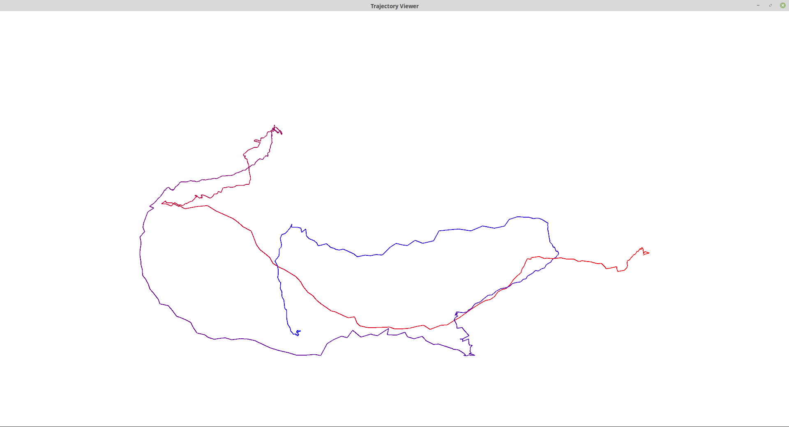

## 2. 群的性质
$\{\mathbb{Z},+\}$是群, 满足群的四个性质:
1. 整数加整数仍然是整数
2. 加法结合律
3. 幺元为0
4. 逆为本身取负

$\{ \mathbb{N}, +\}$不是群, 对于正整数, 其逆不是自然数.

## 3. 向量叉乘的李代数性质
三维空间中的两个向量$\mathbf{a, b}$, 有:

$$
\begin{aligned}
\mathbf{a} \times \mathbf{b} &= -b \times a\\
\mathbf{a} \times \mathbf{b} &= \mathbf{a}^{\wedge} \mathbf{b} = \begin{bmatrix} 0 & -a_3 & a_2\\
a_3 & 0 & -a_1\\
-a_2 & a_1 & 0 
\end{bmatrix} \mathbf{b} = -\begin{bmatrix} 0 & -b_3 & b_2\\
b_3 & 0 & -b_1\\
-b_2 & b_1 & 0 
\end{bmatrix} \mathbf{a}
\end{aligned}
$$

显然, $\mathfrak{g}=\left(\mathbb{R}^{3}, \mathbb{R}, \times\right)$

性质①显然满足, 叉乘的结果任然是三维向量.
将叉乘转换为矩阵相乘, 容易证明性质②也满足.
性质③, 根据叉乘的定义也可知满足.
性质④, 

$$
\begin{aligned}
[X, [Y, Z]] + [Y, [Z,X]] + [Z, [X,Y]] &= X \times (Y \times Z) + Y \times (Z \times X) + Z \times (X \times Y) \\
&= X^{\wedge} Y^{\wedge}Z - Y^{\wedge} X^{\wedge}Z - X \times Y \times Z\\
&= (X^{\wedge} Y^{\wedge} - Y^{\wedge} X^{\wedge})Z - (X^{\wedge}Y)^{\wedge}Z \\
&= (X^{\wedge} Y^{\wedge} - Y^{\wedge} X^{\wedge} - (X^{\wedge}Y)^{\wedge})Z
\end{aligned}
$$

将括号内的矩阵展开:

$$
\begin{aligned}
X^{\wedge} Y^{\wedge} = \begin{bmatrix}-{x_3} {y_3}-{x_2} {y_2} & {x_2} {y_1} & {x_3} {y_1}\\
{x_1} {y_2} & -{x_3} {y_3}-{x_1} {y_1} & {x_3} {y_2}\\
{x_1} {y_3} & {x_2} {y_3} & -{x_2} {y_2}-{x_1} {y_1}\end{bmatrix} \\
Y^{\wedge} X^{\wedge} = \begin{bmatrix}-{x_3} {y_3}-{x_2} {y_2} & {x_1} {y_2} & {x_1} {y_3}\\
{x_2} {y_1} & -{x_3} {y_3}-{x_1} {y_1} & {x_2} {y_3}\\
{x_3} {y_1} & {x_3} {y_2} & -{x_2} {y_2}-{x_1} {y_1}\end{bmatrix} \\
(X^{\wedge}Y)^{\wedge} = \begin{bmatrix}0 & [{x_2} {y_1}-{x_1} {y_2}] & [{x_3} {y_1}-{x_1} {y_3}]\\
[{x_1} {y_2}-{x_2} {y_1}] & 0 & [{x_3} {y_2}-{x_2} {y_3}]\\
[{x_1} {y_3}-{x_3} {y_1}] & [{x_2} {y_3}-{x_3} {y_2}] & 0\end{bmatrix}
\end{aligned}
$$

可得$X^{\wedge} Y^{\wedge} - Y^{\wedge} X^{\wedge}  - (X^{\wedge}Y)^{\wedge} = 0$, 性质④得证.

## 4. SE(3)指数映射推导
根据李代数se(3)的定义:

$$
\mathfrak{s e}(3)=\left\{\boldsymbol{\xi}=\left[\begin{array}{c}{\rho} \\ {\phi}\end{array}\right] \in \mathbb{R}^{6}, \boldsymbol{\rho} \in \mathbb{R}^{3}, \boldsymbol{\phi} \in \mathfrak{s o}(3), \boldsymbol{\xi}^{\wedge}=\left[\begin{array}{cc}{\phi^{\wedge}} & {\rho} \\ {\mathbf{0}^{T}} & {0}\end{array}\right] \in \mathbb{R}^{4 \times 4}\right\}
$$

分析乘积:

$$
\begin{aligned}
\left(\left[\begin{array}{c}{\rho} \\ {\phi}\end{array}\right]^{\wedge}\right)^2  &= \left[\begin{array}{cc}{\phi^{\wedge}} & {\rho} \\ {\mathbf{0}^{T}} & {0}\end{array}\right] \left[\begin{array}{cc}{\phi^{\wedge}} & {\rho} \\ {\mathbf{0}^{T}} & {0}\end{array}\right] = \left[\begin{array}{cc}{(\phi^{\wedge})^2} & {\phi^{\wedge}\rho} \\ {\mathbf{0}^{T}} & {0}\end{array}\right]\\
\Rightarrow	\left(\left[\begin{array}{c}{\rho} \\ {\phi}\end{array}\right]^{\wedge}\right)^n &= \left[\begin{array}{cc}{(\phi^{\wedge})^n} & {(\phi^{\wedge})^{n-1}\rho} \\ {\mathbf{0}^{T}} & {0}\end{array}\right]
\end{aligned}
$$

指数Taylor展开:

$$
\begin{aligned}
\exp \left(\left[\begin{array}{c}{\rho} \\ {\phi}\end{array}\right]^{\wedge}\right) &= \sum_{n=0}^{\infty} \frac{1}{n!}\left(\left[\begin{array}{c}{\rho} \\ {\phi}\end{array}\right]^{\wedge}\right)^n = \frac{1}{0!} \left(\left[\begin{array}{c}{\rho} \\ {\phi}\end{array}\right]^{\wedge}\right)^0  + \sum_{n=1}^{\infty} \frac{1}{n!}\left(\left[\begin{array}{cc}{(\phi^{\wedge})^n} & {(\phi^{\wedge})^{n-1}\rho} \\ {\mathbf{0}^{T}} & {0}\end{array}\right]\right)\\
&= \mathbf{I} + \begin{bmatrix}\sum_{n=1}^{\infty}\frac{1}{n!}(\phi^{\wedge})^n & {\sum_{n=1}^{\infty}\frac{1}{n!}(\phi^{\wedge})^{n-1}\rho} \\ {\mathbf{0}^{T}} & {0}\end{bmatrix}\\
&= \left[\begin{array}{cc}{\sum_{n=0}^{\infty} \frac{1}{n !}\left(\boldsymbol{\phi}^{\wedge}\right)^{n}} & {\sum_{n=0}^{\infty} \frac{1}{(n+1) !}\left(\boldsymbol{\phi}^{\wedge}\right)^{n} \boldsymbol{\rho}} \\ {\mathbf{0}^{T}} & {1}\end{array}\right]
\end{aligned}
$$

由此, 得到Jacobian矩阵. 这里, 利用了矩阵的0次幂是$\mathbf{I}$. 参考SO(3)指数映射的推导, 对Jacobian矩阵做进一步化简:

$$
\begin{aligned}
\mathbf{J} &= \sum_{n=0}^{\infty} \frac{1}{(n+1) !}\left(\boldsymbol{\phi}^{\wedge}\right)^{n} = \sum_{n=0}^{\infty} \frac{1}{(n+1) !}\left(\theta \mathbf{a}^{\wedge}\right)^{n}\\
&= \mathbf{I} + \frac{1}{2!} \theta \mathbf{a}^{\wedge} + \frac{1}{3!} \theta^2 \mathbf{a}^{\wedge} \mathbf{a}^{\wedge} + \frac{1}{4!} \theta^3 \mathbf{a}^{\wedge} \mathbf{a}^{\wedge} \mathbf{a}^{\wedge} + ...\\
\Rightarrow \theta \mathbf{J} &= (\theta + \frac{1}{2!} \theta^2 \mathbf{a}^{\wedge} + \frac{1}{3!} \theta^3 \mathbf{a}^{\wedge} \mathbf{a}^{\wedge} + \frac{1}{4!} \theta^4 \mathbf{a}^{\wedge} \mathbf{a}^{\wedge} \mathbf{a}^{\wedge} + ...)\\
&= -\left(\theta-\frac{1}{3 !} \theta^{3}+\frac{1}{5 !} \theta^{5}-\ldots\right) \mathbf{a}^{\wedge} \mathbf{a}^{\wedge} - \left(1-\frac{1}{2 !} \theta^{2}+\frac{1}{4 !} \theta^{4}-\ldots\right) \mathbf{a}^{\wedge} + \theta + \theta \mathbf{a}^{\wedge} \mathbf{a}^{\wedge} + \mathbf{a}^{\wedge}\\
\Rightarrow J &= \frac{\sin \theta}{\theta} I+\left(1-\frac{\sin \theta}{\theta}\right) \boldsymbol{a} \boldsymbol{a}^{T}+\frac{1-\cos \theta}{\theta} \boldsymbol{a}^{\wedge}
\end{aligned}
$$

## 5.伴随
首先, 证明$\boldsymbol{R} \boldsymbol{a}^{\wedge} \boldsymbol{R}^{\mathrm{T}}=(\boldsymbol{R} \boldsymbol{a})^{\wedge}$:
直观理解为, 对于任意向量$\mathbf{v}$, $\boldsymbol{R} \boldsymbol{a}^{\wedge} \boldsymbol{R}^{\mathrm{T}} \mathbf{v}$可以解释为, 先根据$\mathbf{R}$做一个逆旋转, 然后与$\mathbf{a}$做叉乘, 再根据$\mathbf{R}$旋转回来. 这个等价于对$\mathbf{a}$做完旋转后再叉乘. 又可理解为, 向量先旋转到一个局部坐标系中做叉乘再旋转回全局坐标系, 与先旋转到全局坐标系, 再叉乘等价.

$$
(\boldsymbol{R} \boldsymbol{a}) \times \mathbf{v} = (\boldsymbol{R} \boldsymbol{a}) \times (\boldsymbol{R}\boldsymbol{R}^T\mathbf{v}) = \boldsymbol{R}[\mathbf{a} \times (\boldsymbol{R}^T \mathbf{v})]
$$

对任意向量$\mathbf{v}$均成立, 故而$\boldsymbol{R} \boldsymbol{a}^{\wedge} \boldsymbol{R}^{\mathrm{T}}=(\boldsymbol{R} \boldsymbol{a})^{\wedge}$.

接下来证明$\boldsymbol{R} \cdot \boldsymbol{q}^{\wedge} \cdot \boldsymbol{R}^T = (\boldsymbol{R} \cdot \boldsymbol{q})^{\wedge} \Rightarrow \boldsymbol{R} \exp \left(\boldsymbol{p}^{\wedge}\right) \boldsymbol{R}^{\mathrm{T}}=\exp \left((\boldsymbol{R} \boldsymbol{p})^{\wedge}\right) $

令$\boldsymbol{p} = t \cdot \boldsymbol{q}$, $t \in \mathbb{R}$, 在$t=0$处对$t$求导,有
$$
\begin{aligned}
\left.\frac{d}{d t}\right|_{t=0}\left[\boldsymbol{R} \cdot \exp (t \cdot \boldsymbol{q}) \cdot\boldsymbol{R}^T\right] &= \left.\frac{d}{d t}\right|_{t=0} \exp (\left(\boldsymbol{R} \cdot \mathbf{t} \cdot \boldsymbol{q}\right)_{\times})\\
\left.\boldsymbol{R} \cdot \frac{d}{d t}\right|_{t=0}\left[\mathbf{I}+(t \cdot \boldsymbol{q})_{\times}+O\left(t^{2}\right)\right] \cdot\boldsymbol{R}^T &= \left.\frac{d}{d t}\right|_{t=0}\left[\mathbf{I}+\left(\boldsymbol{R} \cdot t \cdot \boldsymbol{q}\right)_{\times}+O\left(t^{2}\right)\right] \\
\boldsymbol{R} \cdot (t \cdot \boldsymbol{q})_{\times} \cdot \boldsymbol{R}^T &= \left(\boldsymbol{R} \cdot t \cdot \boldsymbol{q}\right)_{\times} \\
\boldsymbol{R} \cdot \boldsymbol{q}^{\wedge} \cdot \boldsymbol{R}^T &= (\boldsymbol{R} \cdot \boldsymbol{q})^{\wedge}
\end{aligned}
$$

## 6. 轨迹的描绘
1. $\boldsymbol{T}_{WC}$的平移部分, 物理意义是机器人在世界坐标系中的位置, 因此, 画出平移部分就画出了机器人运动的轨迹.

2. 结果如下图, 代码见附件.

## 7. 轨迹的误差
我的运算结果答案为: `2.20548`与参考答案`2.207`有些相差, 若有错误, 望指正, 代码见附件.
