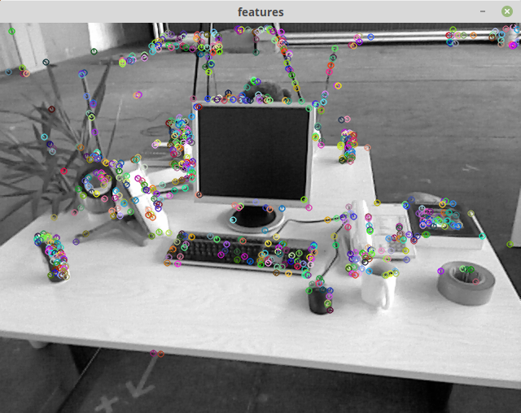
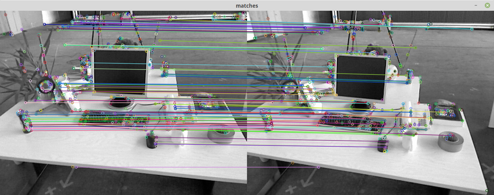
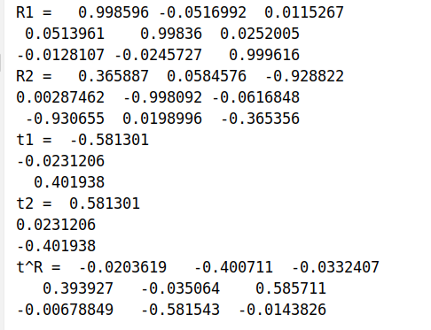
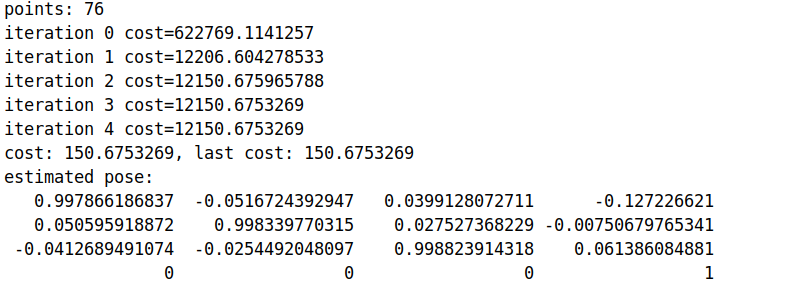
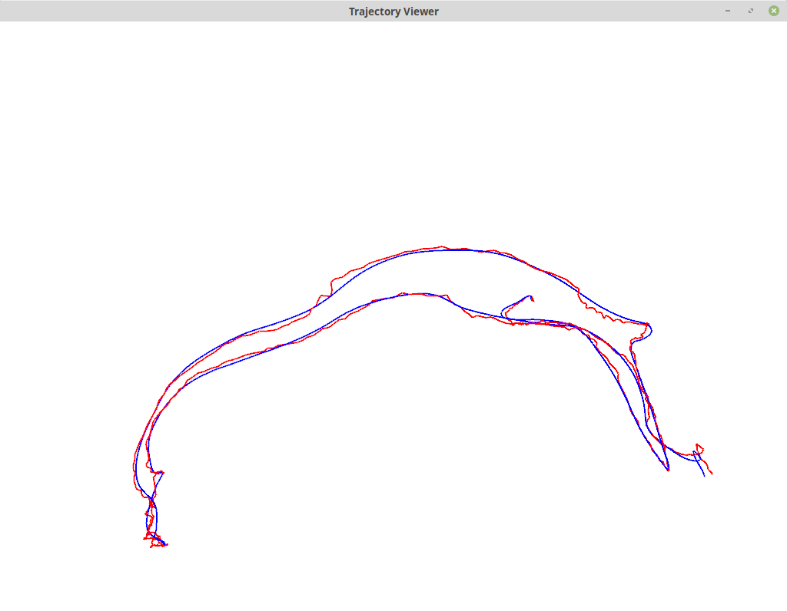

## 2. ORB特征
### 2.1 ORB提取

### 2.2+2.3 ORB描述和暴力匹配

### 问题回答
① ORB的描述符是一个二进制的向量, 因此是一个二进制特征.
② 取50表示有三分之二的特征描述是相似的, 当取更大值时会有很多误匹配, 取更小值则匹配数量会太少.
③ 暴力匹配约花了122ms, 可以根据视差只对局部区域进行搜索, 或者使用kdtree来加速搜索速度.

## 3. E恢复R, t
程序运行结果截图

## 4. G-N BA
程序运行结果截图

问题回答:
① 重投影误差定义为:

$$
e_{i}=u_{i}-\frac{1}{z_{i}} K \exp \left(\xi^{\wedge}\right) P_{i}
$$

这里, $u_i$是像素坐标, $P_i$是点的3D坐标, $K$是相机投影矩阵, $z_i$是$P_i$在相机坐标系下的深度.

② 线性化$e(\xi + \Delta \xi)=e + J \Delta \xi$, Jacobian矩阵为:

$$
\begin{aligned}
J &= \frac{\partial e}{\partial \Delta \xi} =\frac{\partial e}{\partial P'} \frac{\partial P'}{\partial \Delta \xi}\\
\frac{\partial e}{\partial P'} &= -\left[\begin{array}{ccc}{\frac{\partial u}{\partial X^{\prime}}} & {\frac{\partial u}{\partial Y^{\prime}}} & {\frac{\partial u}{\partial Z^{\prime}}} \\ {\frac{\partial v}{\partial X^{\prime}}} & {\frac{\partial v}{\partial Y^{\prime}}} & {\frac{\partial v}{\partial Z^{\prime}}}\end{array}\right]=-\left[\begin{array}{ccc}{\frac{f_{x}}{Z^{\prime}}} & {0} & {-\frac{f_{x} X^{\prime}}{Z^{\prime 2}}} \\ {0} & {\frac{f_{y}}{Z^{\prime}}} & {-\frac{f_{y} Y^{\prime}}{Z^{\prime 2}}}\end{array}\right]\\
\frac{\partial P'}{\partial \Delta \xi} &= \begin{bmatrix}I & -P'^{\wedge} \end{bmatrix}\\
\Rightarrow J &= -\left[\begin{array}{ccc}{\frac{f_{x}}{Z^{\prime}}} & {0} & {-\frac{f_{x} X^{\prime}}{Z^{\prime 2}}} \\ {0} & {\frac{f_{y}}{Z^{\prime}}} & {-\frac{f_{y} Y^{\prime}}{Z^{\prime 2}}}\end{array}\right] \begin{bmatrix}I & -P'^{\wedge} \end{bmatrix}
\end{aligned}
$$

这里对K做了处理, 去除掉了最后一行, 其不构成误差, 偏导数恒等于0.

③ 解出之后做如下更新

$$
\exp(\xi) = \exp (\Delta \xi) \exp(\xi)
$$

## 5. ICP轨迹对齐
程序运行结果:
