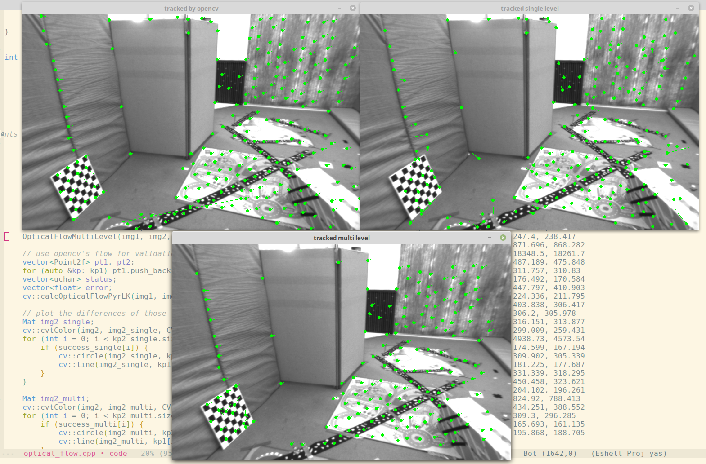

## 2. LK 光流
### 2.1 文献综述
1. 按此论文的分类, 光流法可分为additive和compositional; 以及forward和inverse.

2. 在compositional中，为什么有时候需要做原始图像的 wrap？该 wrap 有何物理意义？
wrap定义了一个函数, 将输入图像上的像素点映射到目标图像上, 当用相机来追踪一个图像块在3D空间中移动时, wrap可以看做是一个仿射变换.
在compositional中, 在原来wrap $W(x;p)$的基础上, 再进行一个微小的wrap $W(x; \Delta p)$来缩小error, 因此需要对原始图像做wrap.

3. forward和 inverse差别
forward使用正向的方式计算增量$\Delta p$, 而inverse则在计算增量时将Input和Template做了个交换, 计算的是增量的逆. 使用inverse的方法计算时, 由于Template图像是固定的, 因此Hessian矩阵是固定的, 可以预计算, 从而提高计算效率.

### 2.2 forward-addtive Gauss-Newton 光流的实现
1. 从最小二乘角度来看，每个像素的误差怎么定义？
从最小二乘角度看, 每个像素误差定义为, 根据追踪的结果移动后, 与目标光度的差:

    $$
    e = I_1(x) - I_2(x+\mathbf{p})
    $$

    这里$\mathbf{p} = [\Delta x_i \; \Delta y_i]^T$, 优化方程定义为:

    $$
    \min_{\mathbf{p}} \sum_W \parallel I_1(\mathbf{x}) - I_2(\mathbf{x+p}) \parallel^2
    $$

2. 相对于自变量的导数定义
像素位置变化之后, 光度的变化率.

    $$
    J = \frac{\partial e}{\partial \mathbf{p}} = -\Delta I_2|_{\mathbf{x=x+p}}
    $$

    $\Delta \mathbf{p}$的计算方法:

    $$
    \begin{aligned}
    J^TJ \Delta \mathbf{p} &= -J^Te\\
    \Rightarrow \Delta \mathbf{p} &= -(J^TJ)^{-1}J^Te
    \end{aligned}
    $$

### 2.3 inverse
使用反向梯度来近似正向梯度:

$$
J = \Delta I_1|_{\mathbf{x}}
$$

### 2.4 multi-level
1. coarse-to-fine是指先在粗糙的图像上获取一个较大的偏移量, 然后再以此为初值在更精细的图像上获得较小的偏移量. 可以有效减少收敛到不好的局部最优的概率.

2. 光流法中使用图像金字塔, 可以在coarse的图像层上计算得到一个较好的初值, 从而收敛到更好的局部最优解, 使得光流对较大的相机运动任然具有可靠性. 而特征点法中图像金子塔的目的是提取不同尺度的特征.

### 2.5 讨论
1. 我们优化两个图像块的灰度之差真的合理吗？哪些时候不够合理？你有解决办法吗？
    优化两个图像块之间的光度误差不完全合理, 相机曝光不同, 或光照条件有变化时不合理, 对于有些物体有局部重复纹理的情况也不合理. 可以加入梯度一致性的cost, 以及周围patch光流值相似的cost.

2. 图像块大小是否有明显差异？取16x16和8x8的图像块会让结果发生变化吗？
当patch大小取为16x16时结果变差很多(能追踪到的点减少大概一半). 当patch大小取为 图像块大小2x2时追踪结果基本不正确. 选择合理的图像块大小对LK光流很重要.

3. 金字塔层数对结果有怎样的影响？缩放倍率呢？
根据构建金子塔的原因: 为了使得光流法对相机的大尺度运动有更好的鲁棒性, 在更粗糙的层上取得一个粗糙的初始值, 再步步细化. 因此, 实际应用中, 需要根据现实情况设置金字塔的层数(若相机运动较快则设置更多层, 反之则设置较少的层数). 缩放倍率的话, 一般取0.5. 假设光流的收敛像素范围不变的话, 那么取0.5正好以二进制的形式覆盖解空间.

### 代码运行结果
正向:

反向:

## 3 直接法
### 3.1 Single Level Direct
1. 该问题中的误差项是什么？
    误差项是重投影光度误差.
    $$
    \begin{aligned}
    e &= I_{ref}(\pi(p)) - I_{cur}(\pi(T_{cur, ref} \mathbf{p}))\\
      &= I_{ref} - I_{cur}(\frac{1}{Z}K\exp(\xi^{\wedge})\mathbf{p})
    \end{aligned}
    $$

2. 误差相对于自变量的雅可比维度是多少？如何求解？

    Jacobian维度为6维.

    $$
    J = \frac{\partial e}{\partial \xi} = -\frac{\partial I_{cur}}{\partial \mathbf{u}} \frac{\partial \mathbf{u}} {\partial \mathbf{q}} \frac{\partial \mathbf{q}}{\partial \xi}
    $$

    这里 $\mathbf{q} = \exp(\xi^{\wedge}) \mathbf{p}$, 有:
    
    $$
    \begin{aligned}
    \frac{\partial \mathbf{u}}{\partial \mathbf{q}} &= \begin{bmatrix} \frac{f_x}{Z} & 0 & -\frac{xf_x}{Z^2}\\ 0 & \frac{f_y}{Z} & -\frac{yf_y}{Z^2} \end{bmatrix} \\
    \frac{\partial \mathbf{q}}{\partial \xi} &= [I \; -\mathbf{q}^{\wedge}]
    \end{aligned}
    $$

    使用Gaussian-Newton求解

    $$
    \begin{aligned}
    H &= J^TJ\\
    b &= -J^T e\\
    \Delta \xi &= H^{-1} b\\
    \exp(\xi^{\wedge}) &\leftarrow \exp((\Delta \xi)^{\wedge}) \exp(\xi^{\wedge})
    \end{aligned}
    $$

3. 窗口可以取多大？是否可以取单个点？
对于窗口大小的取值, 和光流法一样, 需要取合适的大小. 不能取单个点, 与目标像素值相似的可以找到很多, 因此找到的解会很不准确.    

### 3.2 Multi-Level Direct
1. 在缩放图像时，图像内参也需要跟着变化。那么，例如图像缩小一倍， fx; fy; cx; cy 应该如何变化？
图像缩小一倍, $fx, fy, cx, cy$也缩小一倍.

### 3.3 延伸讨论
1. 直接法是否可以类似光流，提出 inverse, compositional 的概念？它们有意义吗？
将直接法与光流算法做类比, 所有选取的patch, 只优化一组参数$\xi$.
    wrap函数$W(\mathbf{x;\xi})$可以不规范地表示为(等式右边去除计算结果的最后一维):

    $$
    W(\mathbf{x; \xi})  = \frac{1}{Z'} K \exp{(\xi^{\wedge})} Z K^{-1} \begin{bmatrix}u\\v\\1\end{bmatrix}
    $$

    这里, $Z'$是重投影到img2上的深度, $Z$是原来在img1中的深度, $\mathbf{x} = [u \; v]^T$
    
    误差项表示为:

    $$
    I_1(\mathbf{x}) - I_2(W(\mathbf{x}; \xi))
    $$
    
    根据我们之前使用的李代数扰动模型, 之前的实现方式就是compositional正向的方法:

    $$
    \begin{aligned}
    &\exp(\xi^{\wedge}) \leftarrow \exp((\Delta \xi)^{\wedge}) \exp(\xi^{\wedge})\\
    &e = I_1(\mathbf{x}) - I_2(W(W(\mathbf{x}; \Delta \xi); \xi))
    \end{aligned}
    $$

    相应地若是提出inverse的方法则误差和更新方式为:

    $$
    \begin{aligned}
    &e = I_1(W(\mathbf{x}; \Delta \xi)) - I_2(W(\mathbf{x}; \xi))\\
    &\exp(\xi^{\wedge}) \leftarrow (\exp((\Delta \xi)^{\wedge}))^{-1} \exp(\xi^{\wedge})
    \end{aligned}
    $$

    img1, img2, $\xi_{21}$, 我们计算一个$\Delta \xi$对img1中的patch进行位置调整, 使得img1的patch更接近与img2的patch, 若是如此, 则需要两张图像都带有深度. 再都有深度的情况下, 可以直接用ICP, 没有必要使用直接法, 因此意义不大.

2. 请思考上面算法哪些地方可以缓存或加速？
在计算Jacobian和error时可以并行计算.

3. 在上述过程中，我们实际假设了哪两个 patch 不变？
我们假设img1中的点, 重投影到img2上之后, 其周围的patch像素值不变.

4. 为何可以随机取点？而不用取角点或线上的点？那些不是角点的地方，投影算对了吗？
可以直接取点的原因是, 与特征点法以及光流法不同, 直接法优化的变量是一个全局的Transform, 因此, 不需要每个点都贡献很多约束, 只要全局的约束足够就能够求解. 不是角点的地方, 投影误差相对比是角点的地方大, 但大部分也是对的.

5. 直接法相对与特征点法的优点
    直接法优点: 
    * 可以省去计算特征点、描述算子的时间.
    * 只需要有像素梯度即可, 无需特征点, 可以应用在特征缺失的场景中.
    * 可以构建半稠密乃至稠密的地图.
    
    直接法缺点: 
    * 非凸性, 直接法完全依靠梯度搜索, 降低目标函数来计算相机位姿. 而图像是强烈非凸函数, 这使得优化算法容易进入极小. 只在运动很小时直接法才能成功.
    * 单个像素没有区分度, 因此需要以图像块做计算. 当每个像素对改变相机运动的"意见"不一致时, 只能少数服从多数, 以数量代替质量.
    * 灰度不变是很强的假设. 若相机自曝光, 当相机曝光参数改变时, 或者当光照变化时该假设被破坏.

### 程序运行结果
为了标记不同的patch, 对颜色做了一些修改. 这里, 程序还有两个问题(bug):
1. 每次运行的结果都有不同.
2. 另外当显示图像时, 最终结果可能会错. 
望指点一二.

## 使用光流计算视差
程序执行结果(其中红点是光流计算的深度点):
