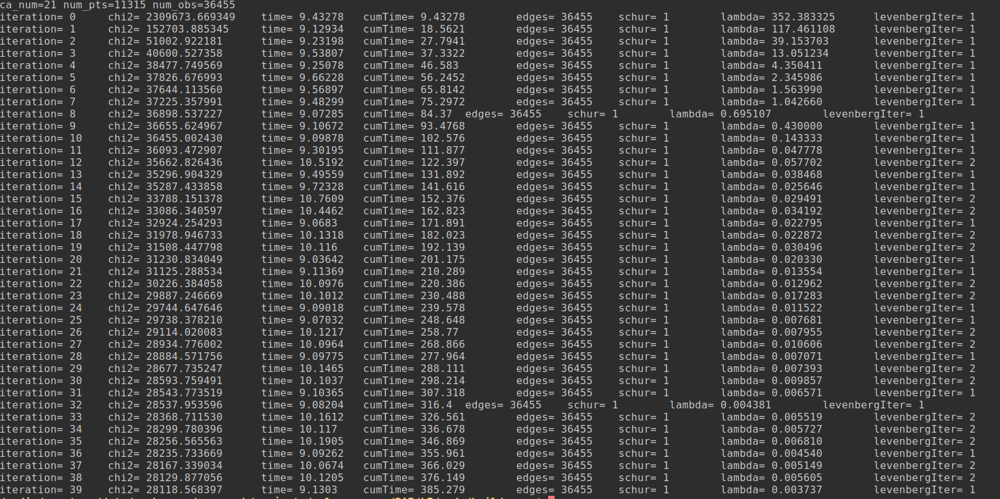
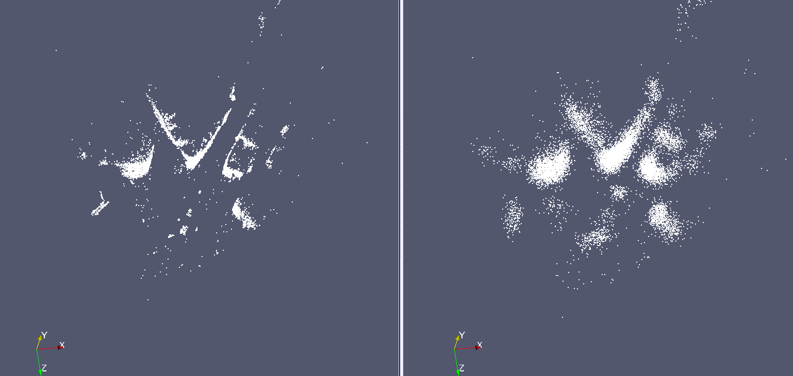
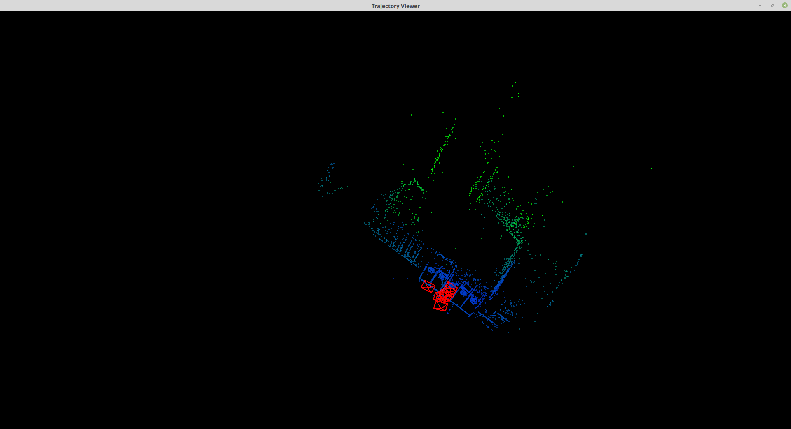

## 2. Bundle Adjustment
### 2.1 文献阅读
1. 为何说 Bundle Adjustment is slow 是不对的？
    说BA慢的大部分原因是没有考虑到问题本身的特点以及其稀疏性, 事实上使用合适的方法, BA速度可以很快.

2. BA中有哪些需要注意参数化的地⽅？ Pose和Point各有哪些参数化⽅式？有何优缺点.
    BA的参数化空间基本上是一个非线性流形——一个由3D特征投影、3D旋转、和相机标定参数笛卡尔积组成的带有非线性约束的流形. 需要注意参数化空间的奇异性、内部约束(如四元素$\parallel q \parallel = 1$)、额外的自由度(如齐次坐标带有scale的自由度). 参数化方法对优化的速度、可靠性影响很大, 因此需要在当前估计附近寻找尽可能均匀, 有界, 表现良好的参数化方式.
    Point的参数化方式有①$(X, Y, Z)^T$ 和 ②$(X, Y, Z, W)^T$两种参数化方式. 参数化方式①下, cost function会很平滑, 距离越远需要的调整的步长越长, 若点的距离都很近则很好, 若有远距离点, 则参数化空间的均匀性会被严重破坏. 参数化方式②下, 对于远距离的点的处理则自然很多, 但需要添加额外约束$\sum X_i^2 = 1$.
    Pose参数化中, 对于旋转部分, 可以使用欧拉角、四元素、李代数. 欧拉角的话需要处理奇异性, 四元素需要归一化.

3. 本⽂写于2000年，但是⽂中提到的很多内容在后⾯⼗⼏年的研究中得到了印证。你能看到哪些
⽅向在后续⼯作中有所体现？请举例说明.
    * 对于相机深度值的参数化方法, 现在流行使用逆深度. 相比于直接使用深度, 参数化空间更加均匀, 也能更好地表示远近不一的点.
    * 其中关于Network Structure的论述, 以及图结构稀疏性的分析, 即是后来的图优化.

### 2.2 BAL-dataset
投影:

$$
\begin{aligned}
\mathbf{q} &= \exp(\phi) \cdot \mathbf{p} + \mathbf{t} \\
\mathbf{q}' &= -\mathbf{q} / \mathbf{q}.z\\
\mathbf{u} &= f\cdot r(\mathbf{q}') \cdot \mathbf{q}'\\
r(\mathbf{q}') &= 1.0 + k1 \cdot \parallel \mathbf{q}' \parallel^2 +k2 \cdot \parallel \mathbf{q}' \parallel^4
\end{aligned}
$$

重投影误差:

$$
\mathbf{e} = \mathbf{x}_{observe} - \mathbf{u}
$$

令$c=[f \; k1 \; k2]^T$, 有Jacobian:
$$
\begin{aligned}
\frac{\partial \mathbf{e}}{\partial \mathbf{c}} &=  [r(\mathbf{q}') \cdot \mathbf{q}' \quad f \cdot (\parallel \mathbf{q}' \parallel^2) \cdot \mathbf{q}' \quad f \cdot (\parallel \mathbf{q}' \parallel^4) \cdot \mathbf{q}']\\
\frac{\partial \mathbf{e}}{\partial \mathbf{p}} &= -\frac{\partial \mathbf{u}}{\partial \mathbf{q}'} \frac{\partial \mathbf{q}'}{\partial \mathbf{q}} \frac{\partial \mathbf{q}}{\partial \mathbf{p}} \\
 \frac{\partial \mathbf{e}}{\partial \mathbf{\phi}} &= -\frac{\partial \mathbf{u}}{\partial \mathbf{q}'} \frac{\partial \mathbf{q}'}{\partial \mathbf{q}} \frac{\partial \mathbf{q}}{\partial \mathbf{\phi}}\\
 \frac{\partial \mathbf{e}}{\partial \mathbf{t}} &= -\frac{\partial \mathbf{u}}{\partial \mathbf{q}'} \frac{\partial \mathbf{q}'}{\partial \mathbf{q}} \frac{\partial \mathbf{q}}{\partial \mathbf{\mathbf{t}}}
\end{aligned}
$$

<!-- 这里，
$$
\begin{aligned}
\frac{\partial \mathbf{u}}{\partial \mathbf{q}'} &= \\
\frac{\partial \mathbf{q}'}{\partial \mathbf{q}} &= \begin{bmatrix} \frac{1}{z} & 0 & -\frac{x}{z^2} \\ 0 & \frac{1}{z} & -\frac{y}{z^2} \\ 0 & 0 & 0\end{bmatrix}
\end{aligned}
$$ -->

程序运行结果(problem-21-11315-pre.txt):

## 3. 直接法的 Bundle Adjustment
### 3.1 数学模型
1. 如何描述任意⼀点投影在任意⼀图像中形成的error?
    任意一点在任意一图像中形成的error与直接法一样: 为投影后整个patch与对应图像上的patch的光度误差.
    $$
    e = I(p_i) - I_j(\pi(KT_jp_i))
    $$
    

2. 每个error关联⼏个优化变量?
    每个error关联优化变量: 相机位姿和3D点的坐标.

3. error关于各变量的雅可⽐是什么?
    令$q=T(\xi)p$,$u = \pi(Kq)$
    $$
    \begin{aligned}
    \frac{\partial e}{\partial p} = -\frac{\partial I}{\partial \mathbf{u}} \frac{\partial \mathbf{u}}{\partial \mathbf{q}} \frac{\partial \mathbf{q}}{\partial \mathbf{p}}\\
     \frac{\partial e}{\partial \xi} = -\frac{\partial I}{\partial \mathbf{u}} \frac{\partial \mathbf{u}} {\partial \mathbf{q}} \frac{\partial \mathbf{q}}{\partial \xi}
    \end{aligned}
    $$
    这里
    $$
    \begin{aligned}
    &\mathbf{u} = \frac{1}{Z} \begin{bmatrix} fx & 0 & cx\\ 0 & f_y & cy \end{bmatrix} \mathbf{p}\\
    &\Rightarrow \frac{\partial \mathbf{u}}{\partial \mathbf{q}} = \begin{bmatrix} \frac{f_x}{Z} & 0 & -\frac{xf_x}{Z^2}\\ 0 & \frac{f_y}{Z} & -\frac{yf_y}{Z^2} \end{bmatrix}\\
    &\frac{\partial \mathbf{q}}{\partial \xi} = [I \; -\mathbf{q}^{\wedge}]\\
    &\frac{\partial \mathbf{q}}{\partial \mathbf{p}} = T(\xi)
    \end{aligned}
    $$

### 3.2实现
程序运行效果:
 

1. 能否不要以 $[x, y, z]^T$ 的形式参数化每个点?
可以以$[x, y, z_{inv}]^T$的方式参数化每个点, $z_{inv} = \frac{1}{z}$.

2. 取 4x4 的 patch 好吗?取更大的 patch 好还是取小一点的 patch 好?
取4x4的patch好, 这个问题和之前直接法计算相机位姿一样, 当patch取小了, 没有区分性. 而patch取大了则会加入很多outlier.

3. 由于图像的差异,你可能需要鲁棒核函数,例如 Huber. 此时Huber的阈值如何选取?
    分析投影后的误差, 根据误差以及匹配情况， 分析匹配和不匹配的分界, 选取Huber的阈值.